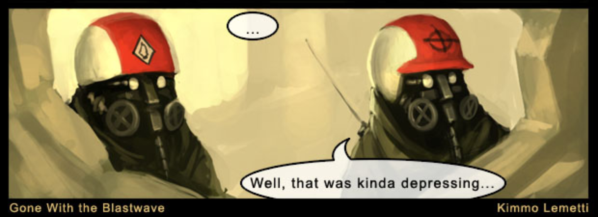
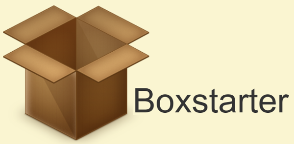
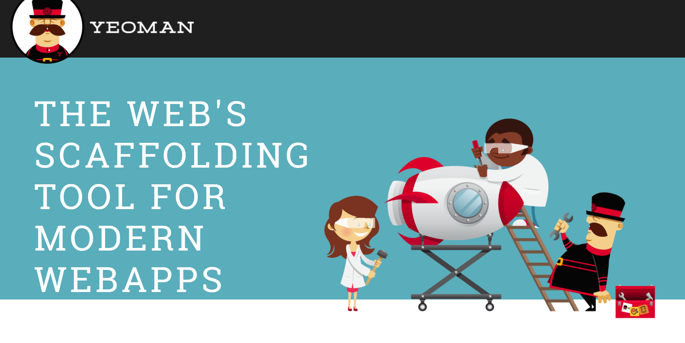
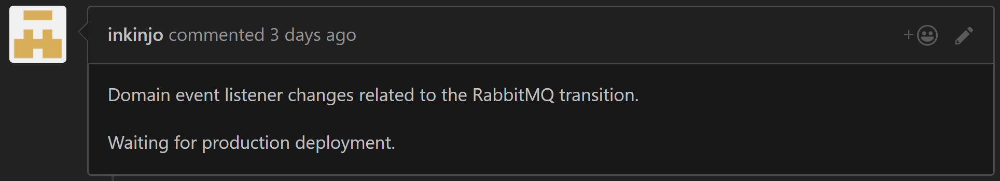
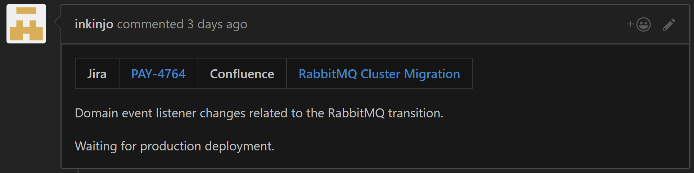
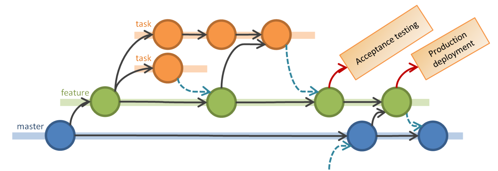
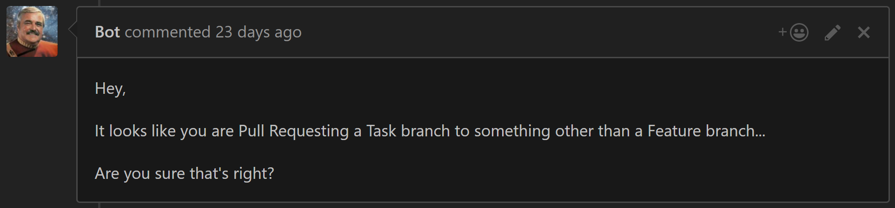

## Automate Everything
### Not Just Your Builds
<br />
<br />
<br />
<br /><br /><br />
#### Andy Davies

github.com/pondidum | twitch.tv/pondidum | twitter.com/pondidum | andydote.co.uk  <!-- .element: class="small" -->
<!-- .slide: data-background="img/topconf-start.png" class="topconf" -->

Note:
* But I mean, still automate your builds :)


 <!-- .element: class="no-border" -->

Note:
* Over in Finland
* No, I am not Finnish...
* But, if you want to come build cool online payment tech, come see me afterwards :)
* and that's enough of that


http://www.oemupdate.com/cover-story/how-automation-could-impact-make-in-india/ <!-- .element: class="attribution" -->

Note:
* while I love our product, and enjoy seeing people use it
* what I really love is making other dev's lives easier
* if they want to add business value, I want to make it easier for them to do
* I dont want them to have to think about repo structure, build scripts, teamcity, infrastructure etc
* just producing value
* I work on 1 or 2 teams, which means I work with 11 other developers
* which means there are at least 12 machines
* with mostly the same software (little differences)


# Dev Environment

Note:
* time to set up a new dev machine!
* it'll be so much quicker than my last
* I just need to install...everything



http://www.blastwave-comic.com/comics/14.jpg <!-- .element: class="attribution" -->


 <!-- .element: class="no-border" -->
https://chocolatey.org/ <!-- .element: class="attribution" -->


```bash
cinst Microsoft-Hyper-V-All -source windowsFeatures
cinst -y docker-for-windows
```

Note:
* scripting installs is easy now!
* but what about restarts?



http://boxstarter.org/ <!-- .element: class="attribution" -->

Note:
* BoxStarter builds on top of chocolatey
* automatic restart detection
* automatic re-login and resume of scripts!


```powershell
Set-WindowsExplorerOptions `
    -EnableShowHiddenFilesFoldersDrives `
    -EnableShowFileExtensions `
    -DisableOpenFileExplorerToQuickAccess

cinst visualstudiocode
cinst visualstudio2015professional
cinst resharper
cinst git.install

cinst Microsoft-Hyper-V-All -source windowsFeatures
cinst docker-for-windows
```

Note:
* we use a much bigger script than this at work!
* Now we have a running machine, what next?


# Project Creation

Note:
* Not really a tech talk without mentioning microservices is it?
* Having a different folder structure for each service is bad
  * mental effort
  * sln/src/source/lib, build script, dependencies, docs
* So as we are a dotnet team, we used...



http://yeoman.io/  <!-- .element: class="attribution" -->

Note:
* Yeoman! which is really aimed at javascript applications
* It is a cli based tool, and you can write your own templates easily


```bash
npm install --global yo
git clone https://github/.../generator-lindorff
cd generator-lindorff
npm link
```


```bash
$ yo --generators

  lindorff
    api
    github
    mvc
    nuget
    service
    solution
    tooling
```

Note:
* api, mvc, service, nuget are the most used
* the use other sub-generators (project prefix usually)
* yo lindorff:nuget


```bash
$ yo lindorff:nuget
? enter the name of the solution: Lindorff.Demo
? enter a short description of the solution: This is a demo nuget package
? enter the name of the project: Lindorff.Demo
```

Note:
* asks many questions
* runs npm install
* runs gulp script


```
|-- Lindorff.Demo.sln
|-- gulpfile.js
|-- nuget.config
|-- package.json
|-- readme.md
`-- src
    |-- Lindorff.Demo
    |   |-- Lindorff.Demo.csproj
    |   |-- Lindorff.Demo.csproj.nuspec
    |   `-- Properties
    |       `-- AssemblyInfo.cs
    `-- Lindorff.Demo.Tests
        |-- Lindorff.Demo.Tests.csproj
        |-- Properties
        |   `-- AssemblyInfo.cs
        |-- Scratchpad.cs
        `-- packages.config
```

Note:
* leaves you with a directory something like this


`yo lindorff:github`

Note:
* uses the github api to create a private repository, setting up:
  * correct teams (owners, admins etc)
  * branch protection
  * webhooks (we'll come back to these later)
* we want to do similar for TeamCity
  * but it's rest api is awful
* and for octopus
  * which has a nice api
  * but we haven't worked out a standard pipeline yet


# Git

Note:
* Now we have created our new repository we can move on to automating git


* `git s`
* `git cm "my commit message"` <!-- .element: class="fragment" -->
* `git dc` <!-- .element: class="fragment" -->
* `git scrub` <!-- .element: class="fragment" -->

<!-- .element: class="list-unstyled" -->
Note:
* Look at how many characters we can save typing!


# Rebasing?

Note:
* So how many people here use rebase?
* those of you who don't, I assume you dont use git?
* seriously rebase.
* who doesn't love seeing this message


```bash
$ git rebase master
Cannot rebase: You have unstaged changes.
Please commit or stash them.
```


* `git save`
* `git rebase` <!-- .element: class="fragment" -->
* `git undo` <!-- .element: class="fragment" -->
* `git push` <!-- .element: class="fragment" -->
* `git web` <!-- .element: class="fragment" -->

<!-- .element: class="list-unstyled" -->
Note:
* you could make an alias to do all of this...


`git pr`

Note:
* now, talking of pull requests


`git checkout -b feature-NewCoolThing-PAY-1234`

Note:
* task/backlog ids go at the end of branch names
* we also put them in commit messages for other integration


### prepare-commit-msg
```bash
#!/bin/sh

TAG=$(git rev-parse --abbrev-ref HEAD | grep -oP '(?<=-)([a-zA-Z]{3,4}-\d*)')

echo -n "[$TAG]"' '|cat - "$1" > /tmp/out && mv /tmp/out "$1"
```

Note:
* extracts the task tag from the branch name
* prefixes commit messages with it
* don't forget error handling...


```bash
$ git cm "my awesome feature"
[feature-NewCoolThing-PAY-1234 87b7d9a] [PAY-1234] my awesome feature
 1 file changed, 1 insertion(+), 1 deletion(-)
```


### pre-commit

```bash
#!/bin/sh
git stash -q --keep-index

gulp test --no-cover
RESULT=$?

git stash pop -q

[ $RESULT -ne 0 ] && exit 1
exit 0
```

Note:
* runs your tests (best hope they're fast!)
* note we stash everything, then test, then pop stash
* this is so we only test the things being committed :)


```bash
$ git cm "hooks: add prepare commit message"
[21:24:08] Using gulpfile ./gulpfile.js
[21:24:08] Starting 'test'...
[21:24:08] 'test' errored after 700 us
[21:24:08] Error in plugin 'test-runner'
Message:
    There were an odd number of characters.
```


```bash
$ git cm "hooks: add prepare commit message"
[21:24:08] Using gulpfile ./gulpfile.js
[21:24:08] Starting 'test'...
[21:25:22] Finished 'test' after 484 us
[master 5221827] hooks: add prepare commit message
 1 file changed, 5 insertions(+)
 create mode 100644 hooks/prepare-commit-msg
```


# Installation?


```bash
#!/bin/sh

# windows not happy about symbolic links
if [[ -n "$WINDIR" ]]; then
  find hooks/ -exec sh -c 'ln --force ./{} .git/hooks/$(basename {})' \;
else
  find hooks/ -exec sh -c 'ln -s --force ./{} .git/hooks/$(basename {})' \;
fi

echo 'hooks installed.'
```

Note:
* scripted of course!
* windows doesnt like symlinked files through ln, so hard links
* shame we cant write a hook to install hooks on pull...


# Pull Requests

Note:
* pull requests are the backbone of our dev process, so there is quite a lot to hang off them


* Fix PR title
* Add documentation links <!-- .element: class="fragment" -->
* Check merge target <!-- .element: class="fragment" -->

<!-- .element: class="list-unstyled list-spaced" -->

Note:
* implemented in aws lambda


* `git push origin feature-NewCoolThing-PAY-1234`
*  <!-- .element: class="fragment no-border" -->
*  <!-- .element: class="fragment no-border" -->

<!-- .element: class="list-unstyled list-spaced center" -->


*  <!-- .element: class="no-border" -->
*  <!-- .element: class="fragment no-border" -->

<!-- .element: class="list-unstyled list-spaced center" -->




Note:
* while I am not a huge fan of this branching strategy, it does work for us
* github will always suggest to merge to master from a branch
* so the bot will ask if you are sure if it thinks you are wrong


 <!-- .element: class="no-border" -->


# Infrastructure

Note:
* We are going to use a lot of Hashicorp tools here
* there are others (such as aws's cloudformation), but Hashicorp's are better (and cross platform!)
* We are veering into experimental stages here, we are still working out how we want to do things at work


```json
"builders": [{
  "type": "amazon-ebs",
  "region": "eu-west-1",
  "source_ami_filter": {
    "filters": {
      "name": "ubuntu/images/hvm-ssd/ubuntu-trusty-14.04-amd64-server-*"
    },
    "owners": ["099720109477"],
    "most_recent": true
  },
  "instance_type": "t2.micro",
  "ami_name": "HelloService {{build_version}}",
  "tags": { "service": "HelloService", "version": "{{build_version}}" },
  "provisioners": [
    { "type": "shell", "script": "./install.sh" }
  ]
}]
```

Note:
* this is a Packer script
* we can use packer to create machine images, including AMIs, vagrant boxes, hyper-v images etc.
* so our build script now calls packer, generating an AMI with the service installed


```powershell
resource "aws_autoscaling_group" "hello_service" {
  min_size: 1
  max_sizw: 5,
  launch_configuration: "${aws_launch_configuration.hello_service.name}"
}

resource "aws_launch_configuration" "hello_service" {
  image_id = "${data.aws_ami.hello_service.id}"
  instance_type = "t2.micro"
}

data "aws_ami" "hello_service" {
  most_recent = true
  filter { name = "tag:service" values = ["HelloService"] }
  filter { name = "tag:environment" values = ["${var.environment}"] }
}
```

Note:
* this is terraform
* allows us to script cloud resources
* tags on the ami finder for the specific environment
* we can add tags to an ami later to move it into other environments


# Multiple Environments


## ChatOps?

* Andy: Deploy HelloService to Production <!-- .element: class="fragment" -->
* <span>Bot: Production is `1.0.0`, I will promote `1.0.1`, ok?</span> <!-- .element: class="fragment" -->
* <span>Andy: yes</span> <!-- .element: class="fragment" -->
* <span>Bot: Deploying `HelloService @ 1.0.1` to `Production`</span> <!-- .element: class="fragment" -->
* <span>Bot: Completed `HelloService @ 1.0.1` to `Production`</span> <!-- .element: class="fragment" -->

<!-- .element: class="list-unstyled list-spaced" -->
Note:
* visibility of current state? some kind of webui?
* don't want to write our own tool for this
* perhaps we can leverage Octopus


* `code`
* `pull request` <!-- .element: class="fragment" -->
* `teamcity (gulp)` <!-- .element: class="fragment" -->
* `-> ami` <!-- .element: class="fragment" -->
* `-> rolling-update (env: test)` <!-- .element: class="fragment" -->
* `chatops` <!-- .element: class="fragment" -->
* `-> tag ami (env: qa)` <!-- .element: class="fragment" -->
* `-> rolling-update (env: qa)` <!-- .element: class="fragment" -->

<!-- .element: class="list-unstyled list-spaced" -->


# Where next?


* Build Process -> Try and use it <!-- .element: class="fragment" -->
* Observe Adhoc Processes -> Automate <!-- .element: class="fragment" -->

<!-- .element: class="list-unstyled list-spaced" -->

Note:
* some final advice
* be ready to change your automation
* processes evolve
* I'd automate the coffee machines, but I think the receptionist does it before I get in
* Don't make a process, then try and work with it


<div class="left">
<h2>Andy Davies</h2>
<h4>Lindorff Oy</h4>
<h4>andy@andydote.co.uk</h4>
<br />
  <ul class="list-unstyled small">
    <li><strong>chocolatey.org</strong> - environment setup</li>
    <li><strong>boxstarter.org</strong> - environment setup</li>
    <li><strong>yeoman.io</strong> - project scaffolding</li>
    <li><strong>packer.io</strong> - machine image creation</li>
    <li><strong>terraform.io</strong> - infrastructure as code</li>
  </ul>
</div>

<div class="right">
</div>

<!-- .slide: data-background="img/topconf-end.png" class="topconf" -->