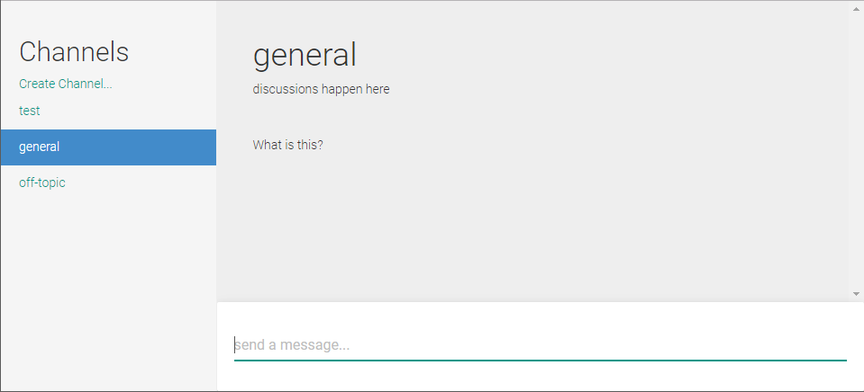
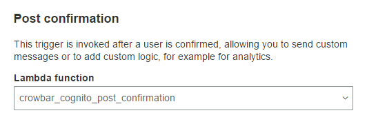
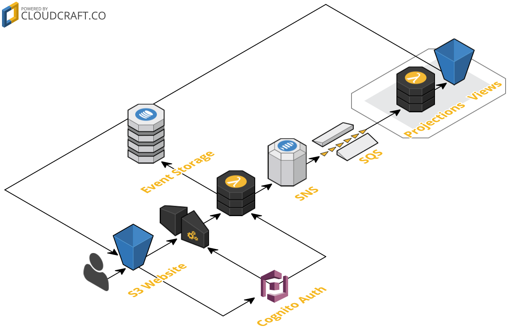

### Building a Serverless, EventSourced, Slack Clone


##### AndyDote.co.uk &nbsp; | &nbsp; github.com/pondidum &nbsp; | &nbsp; @pondidum
http://stavrapid-official.deviantart.com/art/Half-Life-3-logo-with-logotypes-466077248<!-- .element: class="image-attribution"-->
https://geteventstore.com/<!-- .element: class="image-attribution"-->

Note:
* we're not using EventStore *sadface*
* I work for Lindorff Oy,  helping to build an online payment service


# Why build this?
Note:
* to see if complex apps could be made without a single EC2 instance
* And as you can guess from that, this is AWS based
* practical experience with aws services I havent used before


# Chat App == Simple
# right? <!-- .element: class="fragment" -->


## terraform all the things!
Except cognito : (<!-- .element: class="small fragment" -->

http://hyperboleandahalf.blogspot.fi/2010/06/this-is-why-ill-never-be-adult.html<!-- .element: class="image-attribution"-->
Note:
* hashicorp's terraform tool to manage all aws stuff...
* works with other clouds too, like Azure or....are there any others, really?
* No cognito support yet (coming soon)
* for a through guide, look up Paul Stack or James Nugent's talks :)


```bash
variable "region" {
  default = "eu-west-1" # Irish region best region!
}

variable "bucket_name" {
  default = "crowbar-store"
}

provider "aws" {
  profile = "default"
  region = "${var.region}"
}

data "aws_caller_identity" "current" {}
```
Note:
* `aws_caller_identity` will fetch our account_id, no need to hard code it
* put our common variables here (such as bucket names, db names etc)


```bash
resource "aws_s3_bucket" "storage" {
  bucket = "${var.bucket_name}"
  acl = "public-read"
}
```
Note:
* very complex, no?


```bash
data "template_file" "s3_role_policy" {
  template = "${file("policies/api-lambda-role-policy.json")}"
  vars {
    bucket_name = "${var.bucket_name}"
  }
}

resource "aws_iam_role" "crowbar_lambda_role" {
  name = "crowbar_lambda_role"
  assume_role_policy = "${file("policies/api-lambda-role.json")}"
}

resource "aws_iam_role_policy" "crowbar_lambda_role_policy" {
  name = "crowbar_lambda_role_policy"
  role = "${aws_iam_role.crowbar_lambda_role.id}"
  policy = "${data.template_file.s3_role_policy.rendered}"
}
```
Note:
* policies are expressed in json
* template_file is a merge engine, only replaces bucket name in the policy json


```json
{
  "Version": "2012-10-17",
  "Statement": [
      {
          "Effect": "Allow",
          "Action": [
              "s3:GetObject*",
              "s3:PutObject*"
          ],
          "Resource": [
              "arn:aws:s3:::${bucket_name}/*"
          ]
      }
  ]
}
```



Note:
* super simple looking ui
* its react, redux, bootstrap based
* create channels, send messages, register and login is all you get


```bash
data "template_file" "s3_public_policy" {
  template = "${file("policies/s3-public.json")}"
  vars {
    bucket_name = "${var.site_bucket}"
  }
}

resource "aws_s3_bucket" "static_site" {
  bucket = "${var.site_bucket}"
  acl = "public-read"
  policy = "${data.template_file.s3_public_policy.rendered}"
  website {
    index_document = "index.html"
  }
}

output "url" {
  value = "${aws_s3_bucket.static_site.bucket}.s3-website-${var.region}.amazonaws.com"
}
```
Note:
* when uploading your site, don't forget content-type on files, else bad things


```json
{
  "Version": "2012-10-17",
  "Statement": [
    {
      "Sid": "PublicReadGetObject",
      "Effect": "Allow",
      "Principal": "*",
      "Action": [
        "s3:GetObject"
      ],
      "Resource": [
        "arn:aws:s3:::${bucket_name}/*"
      ]
    }
  ]
}
```


# Commands
* register_user
* create_channel
* join_channel
* leave_channel
* send_message
* edit_message
Note:
* this was my initial idea for structure
* what are our aggregates?
  * can messages be posted to multiple channels at once? (e.g. hashtags on twitter)
  * or are channels owners of messages?
* storage of events
  * store as a single stream?
  * split by aggregate?


<ul class="left">
  <li><h2>UserAggregate</h2></li>
  <li>register_user</li>
  <li>create_channel</li>
  <li>join_channel</li>
  <li>leave_channel</li>
</ul>
<ul class="right">
  <li><h2>ChannelAggregate</h2></li>
  <li>create_channel</li>
  <li>join_channel</li>
  <li>leave_channel</li>
  <li>send_message</li>
  <li>edit_message</li>
</ul>
Note:
* we have events which multiple aggregates care about
* we can either introduce a separation


Note:
* join_channel
* command -> store -> router -> aggregate methods -> aggregate events
* each aggregate would create it's own eventsourcing event based on the command


```csharp
public class ChannelAggregate : AggregateRoot
{
  public void Join(User user)
  {
    //validation...

    var e = new UserJoinedChannelEvent(userId: user.id, channelId: this.id);
    Apply(e);
  }

  private void Handle(UserJoinedChannelEvent e)
  {
    _users.Add(e.UserId);
  }
}
```
Note:
* event creation happens within the aggregate (commands to api)
* handler execution is called by `Apply` and by loading
* Projections are elsewhere


```csharp
public class ChannelProjection : Projection
{
  public IEnumerable<string> => _users;
  public string Name { get; private set; }
  public string Description { get; private set; }

  private readonly HashSet<string> _users;

  private void Handle(UserJoinedChannelEvent e)
  {
    _users.Add(_userView.GetOrDefault(e.UserId).Name);
  }

  private void Handle(ChannelCreatedEvent e)
  {
    Name = e.Name;
    Description = e.Description;
  }
}
```
Note:
* uses a userview projection/service to get usernames from the id
* this would be async to saving of events
* we have the option of splitting the aggregates
  * public methods clientside
  * handlers serverside


```csharp
public class ChannelAggregate
{
  public void Join(User user)
  {
    //validation...

    var e = new UserJoinedChannelEvent(
      userId: user.id,
      channelId: this.id);

    Apply(e);
  }

  void Handle(UserJoinedChannelEvent e)
  {
    _users.Add(e.UserId);
  }
}

public class ChannelProjection
{
  void Handle(UserJoinedChannelEvent e)
  {
    _users.Add(_userView
      .GetOrDefault(e.UserId)
      .Name);
  }
}
```
<!-- .element: class="left"-->
```javascript
//client side:
const join = user =>
{
  var command = CreateCommand({
    userId: user.id,
    channelId: this.id);
  });

  Validate(this, command);
  Dispatch(command);
}
```
<!-- .element: class="right fragment"-->
```javascript
//serverside sync
const onCommand = command => {
  Store(command);
  TriggerAggregates(command);
}
```
<!-- .element: class="right fragment"-->
```javascript
//serverside async
exports.handler = command => {
  const channel = fetch(command.channelId)

  channel[command.type](command)
}
```
<!-- .element: class="right fragment"-->
Note:
* it's now javascript
* clientside `Dispatch` is in browser, calls api-gateway
* serverside sync is lambda which responds with ok if the event was stored
* serverside async is lamdbas for projecting events into views
* protect the api to logged in users using cognito


```javascript
const channelAggregate = {

  JOIN_CHANNEL: function(command) {
    const event = Object.assign(
      { },
      command,
      { type: 'USER_JOINED_CHANNEL' })

    this.apply(event)
  },

  USER_JOINED_CHANNEL: function(event) {
    if (this.users.indexOf(event.userId) === -1)
      this.users.push(event.userId);
  },
}
```


```javascript
const command = {
  timestamp: new Date().getTime(),
  eventId: uuid(),
  type: "JOIN_CHANNEL",
  userId: 1233123,
  channelId: "general"
}
```
<!-- .element: class="left"-->
```javascript
const event = {
  timestamp: new Date().getTime(),
  eventId: uuid(),
  type: "USER_JOINED_CHANNEL",
  userId: 1233123,
  channelId: "general"
}
```
<!-- .element: class="right fragment"-->
Note:
* all the commands are very simple (to start with)
* timestamp and eventid handled by the serverside
* the rest is pretty light, so mvp can be smaller


Note:
* event -> store -> router -> aggregate
* events from the ui get sent to each
* storing in a single stream helps here, we can re-process events to make the split later


https://kafka.apache.org/intro <!-- .element: class="image-attribution"-->
Note:
* Kafka would be pretty ideal for this
* But it's not serverless


## Kinesis

https://aws.amazon.com/kafka/ <!-- .element: class="image-attribution"-->
Note:
* Kinesis streams are pretty similar to Kafka
* But there is a problem, we want permanent log storage
* "the retention period and is configurable in hourly increments from 1 to 7 days."
* choice:
  * use kafka (ec2/docker)
  * work around Kinesis
  * something else
* not going to break the serverless requirement that easily!
  * events will have timestamps & uuids
  * so store in rds/dynamo
  * if an aggregate needs stream position, it can store last-read uuid


http://www.yegor256.com/2014/05/18/cloud-autoincrement-counters.html <!-- .element: class="image-attribution"-->
Note:
* cant store empty string values!


```bash
resource "aws_dynamodb_table" "event_store" {
  name = "CrowbarEvents"
  write_capacity = 5
  read_capacity = 20

  hash_key = "eventId"
  range_key = "timestamp"

  attribute {
    name = "eventId"
    type = "S"
  }

  attribute {
    name = "timestamp"
    type = "N"
  }
}
```


```javascript
const event = {
  timestamp: new Date().getTime(),
  eventId: uuid(),
  type: "CHANNEL_CREATED",
  userId: 1233123,
  channelId: uuid(),
  channelName: "general",
  channelDescription: ""
}
```
<!-- .element: class="left"-->
```javascript
const event = {
  timestamp: new Date().getTime(),
  eventId: uuid(),
  type: "CHANNEL_CREATED",
  userId: 1233123,
  channelId: uuid(),
  channelName: "general",
  channelDescription: null
}
```
<!-- .element: class="right fragment"-->


```bash
resource "aws_api_gateway_rest_api" "api" {
  name = "Crowbar Event Api"
  description = "Http api for consuming Crowbar events"
}

resource "aws_api_gateway_resource" "events" {
  rest_api_id = "${aws_api_gateway_rest_api.api.id}"
  parent_id = "${aws_api_gateway_rest_api.api.root_resource_id}"
  path_part = "events"
}

resource "aws_api_gateway_method" "events_post" {
  rest_api_id = "${aws_api_gateway_rest_api.api.id}"
  resource_id = "${aws_api_gateway_resource.events.id}"
  http_method = "POST"
  authorization = "NONE" # terraform doesnt support cognito yet
}

resource "aws_api_gateway_integration" "events_post_lamdba" {
  rest_api_id = "${aws_api_gateway_rest_api.api.id}"
  resource_id = "${aws_api_gateway_resource.events.id}"
  http_method = "${aws_api_gateway_method.events_post.http_method}"
  type = "AWS_PROXY"
  uri = "arn:aws:apigateway:${var.region}:lambda:path/2015-03-31/functions/arn:aws:lambda:${var.region}:${data.aws_caller_identity.current.account_id}:function:${aws_lambda_function.crowbar_api_event_lambda.function_name}/invocations"
  integration_http_method = "POST"
}
```
Note:
* while this looks fairly daunting, it's not bad
* an api, single path part "events"
* supports "POST"
* triggers a lambda
* note we can't setup cognito auth yet
* most of this was taken from the terraform docs


```javascript
exports.handler = function(awsEvent, context, callback) {

  const defaultValues = { eventId: uuid() }
  const forcedValues = { timestamp: new Date().getTime() }

  const event = Object.assign(
    defaultValues,
    JSON.parse(awsEvent.body),
    forcedValues)

  writeToStorage(event)
  triggerProjections(event)

  sendOkResponse(callback)
}
```
Note:
* error handling has been omitted
* the lambda controls the timestamp and eventId
* no sequence number used
  * don't want to cause blocking resource
  * ordering by date should be good enough
  * this could be solved using rds postgres with a `serial` column


```javascript
const aws = require('aws-sdk')
const lambda = new aws.Lambda({ region: 'eu-west-1' })

module.exports = event => {

  const command = {
    InvocationType: 'Event',
    Payload: JSON.stringify(event),
    FunctionName: 'crowbar_projections'
  }

  return new Promise((resolve, reject) =>
    lambda.invoke(command, (err, data) => {
      if (err) reject(err)
      else resolve(data)
    })
  )
}
```


```javascript
const updateView = require('./util/updateView')
const allChannels = require('./projections/allchannels')
const allUsers = require('./projections/allusers')

const projections = [
  allChannels,
  allUsers
]

exports.handler = event => Promise.all(
  projections.map(project =>
    updateView(project(event))
  )
)
```
Note:
* currently all projects are run (async) within one lambda
* could move this to trigger 1x lambda per projections if needed
* `updateView` manages s3 interaction, loads a file, updates it, writes it back


```javascript
const handlers = {
  CHANNEL_CREATED: (view, event) => {
    return view.concat([createChannel(event)])
  },

  USER_JOINED_CHANNEL: (view, event) => {
    return updateChannel(view, event.channelId, existing => {
      return { users: existing.users + 1 }
    })
  }
}

module.exports = event => {
  const handler = handlers[event.type]

  return {
    viewName: 'allchannels',
    defaultView: [],
    callback: view => handler(view, event)
  }
}
```
Note:
* handlers are given the current view and event
* return a new view
* `updateView` creates a new array based off old, with one element replaced with an updated version


Note:
* a static website deployed to s3 (react based)
* an api-gateway, protected by cognito
* a lambda to receive events from the website
* one lambda per aggregate root to process events
* views stored as json in s3
* static site loads s3 objects
* n.b., not really using the event storage for anything yet


# Cognito

https://aws.amazon.com/cognito/ <!-- .element: class="image-attribution"-->
Note:
* easy to add an api-gateway authoriser for
* but you have to do it manually, as terraform doesn't support it yet


```javascript
const userPool = new CognitoUserPool({
  UserPoolId: 'eu-west-1_uZwatXisF',
  ClientId: 'wat_is_a_client_id_philosophically_?'
})

return new Promise((resolve, reject) => {
  const userId = uuid()
  const attributes = [
    new CognitoUserAttribute({ Name: 'email', Value: email })
  ]

  userPool.signUp(userId, password, attributes, null, (err, result) => {
    if (err) return reject(err)

    dispatch(userChanged(result.user))
    resolve(result.user)
  })
})
```
Note:
* using redux, hence the dispatch
* userid is a guid, allows users to change email later
* can login with the email :)


```javascript
return new Promise((resolve, reject) => {
  const authenticationDetails = new AuthenticationDetails({
    Username: username,
    Password: password
  })

  const cognitoUser = new CognitoUser({
    Username: username,
    Pool: userPool
  })

  cognitoUser.authenticateUser(authenticationDetails, {
    onFailure: reject,
    onSuccess: result => {

      AWSCognito.config.credentials = new CognitoIdentityCredentials({
        Logins: {
          [cognitoPoolUri]: result.getIdToken().getJwtToken()
        }
      })

      dispatch(userChanged(cognitoUser))
      resolve(result)
    }
  })
})
```


```javascript
const userPool = new CognitoUserPool({
  UserPoolId: 'eu-west-1_uZwatXisF',
  ClientId: 'wat_is_a_client_id_philosophically_?'
})
```
Note:
* having a userPoolId and clientId in clientside code worries me
* but I found this on the aws forums


> ...with userPoolId and clientId, only unauthenticated APIs can be called, for eg: SignUp, authenticate, forgotPassword etc.
>
> So userPoolId and clientId alone are not enough to do any malicious activity on your user pool.

Note:
* so it's fine, I guess?
* you could hide calls behind public api-gateway methods too if preferred



Note:
* support for other triggers (e.g. PreAuthentication, PostAuthentication)
* could log login attempts, create a projection for detecting attacks


```javascript
exports.handler = function(awsEvent, context) {

  const attributes = awsEvent.request.userAttributes

  const event = {
    eventId: uuid(),
    timestamp: new Date().getTime(),
    type: 'USER_REGISTERED',
    userId: attributes.sub,
    email: attributes.email
  }

  writeToStorage(event)
  triggerProjections(event)

  context.done(null, awsEvent)
}
```
Note:
* very similar to the api event handler
* we control the whole event, so no need for default eventId, timestamp handling


# Scalability?
Note:
* s3 is scalable, so ui & views are fine for access


Note:
* there are issues however
* s3 parallel updates could cause data loss
* also entries could appear out of order
  * especially if you are getting multiple messages a second



Note:
* use sns and sqs
* have one aggregate per queue
* this enforces in-order messaage processing
* why not do this to start with? start with mvp
* sns is here so we can add other queues later without much changing


Note:
* should be fairly simple to manage
* for each event, sns -> sqs it
* or for a specific aggregate, just event -> sqs


# Plugins!
Note:
* plugins should not effect the running of system
* we can attach them via queues
* either at the command phase, or at the event phase


Note:
* each plugin get's it's own queue
* could back-populate the queue on creation if needed
* could provide a set of standard lambdas which do things like POST to uri
* could also support using the full arn for a lambda in a different aws account
* a plugin I want to try is an IRC adaptor...but can it be Serverless?


# Wrapping Up
* I've learnt loads about AWS, Terraform <!-- .element: class="fragment"-->
* Serverless trade-offs <!-- .element: class="fragment"-->
* Code available here: https://github.com/pondidum/crowbar  <!-- .element: class="fragment"-->
Note:
* aws: cognito, dynamodb
* code: soon = probably next week


# Questions?

##### AndyDote.co.uk &nbsp; | &nbsp; github.com/pondidum &nbsp; | &nbsp; @pondidum
