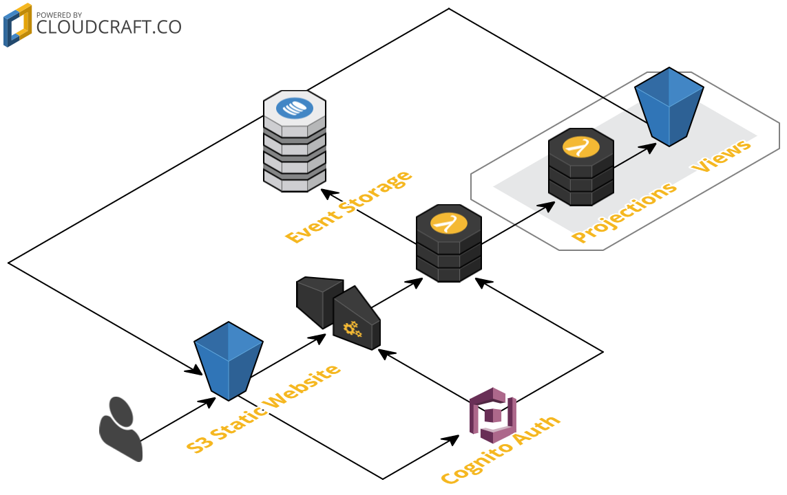

### Building a Serverless, EventSourced, Slack Clone


##### AndyDote.co.uk &nbsp; | &nbsp; github.com/pondidum &nbsp; | &nbsp; @pondidum
http://stavrapid-official.deviantart.com/art/Half-Life-3-logo-with-logotypes-466077248<!-- .element: class="image-attribution"-->
https://geteventstore.com/<!-- .element: class="image-attribution"-->

Note:
* we're not using EventStore *sadface*
* I work for Lindorff Oy,  helping to build an online payment service


# Why build this?
Note:
* to see if complex apps could be made without a single EC2 instance
* And as you can guess from that, this is AWS based
* practical experience with aws services I havent used before


# Chat App ==  Simple
# right? <!-- .element: class="fragment" -->


* channel_created
* message_sent
* message_edited
* user_joined_channel
* user_left_channel
* user_registered
Note:
* this was my initial idea for structure
* what are our aggregates?
  * can messages be posted to multiple channels at once? (e.g. hashtags on twitter)
  * or are channels owners of messages?
* storage of events
  * store as a single stream?
  * split by aggregate?


<ul class="left">
  <li><h2>UserAggregate</h2></li>
  <li>user_registered</li>
  <li>channel_created</li>
  <li>user_joined_channel</li>
  <li>user_left_channel</li>
</ul>
<ul class="right">
  <li><h2>ChannelAggregate</h2></li>
  <li>channel_created</li>
  <li>user_joined_channel</li>
  <li>user_left_channel</li>
  <li>message_sent</li>
  <li>message_edited</li>
</ul>
Note:
* we have events which multiple aggregates care about
* we can either introduce a separation


Note:
* command -> store -> router -> aggregate methods -> aggregate events
* each aggregate would create it's own eventsourcing event based on the command


```javascript
const event = {
  timestamp: new Date().getTime(),
  eventId: uuid(),
  type: "USER_JOINED_CHANNEL",
  userId: 1233123,
  channelId: "general"
}
```
Note:
* all the commands are very simple (to start with)
* timestamp and eventid handled by the serverside
* the rest is pretty light, so mvp can be smaller


Note:
* event -> store -> router -> aggregate
* events from the ui get sent to each
* storing in a single stream helps here, we can re-process events to make the split later


https://kafka.apache.org/intro <!-- .element: class="image-attribution"-->
Note:
* Kafka would be pretty ideal for this
* But it's not serverless


## Kinesis

Note:
* Kinesis streams are pretty similar to Kafka
* But there is a problem, we want permanent log storage
* "the retention period and is configurable in hourly increments from 1 to 7 days."
* choice:
  * use kafka (ec2/docker)
  * work around Kinesis
  * something else
* not going to break the serverless requirement that easily!
  * events will have timestamps & uuids
  * so store in rds/dynamo
  * if an aggregate needs stream position, it can store last-read uuid


## Aggregates
note:
* we only need two aggregates to start with
* channels are the primary aggregate
* has messages, users watching


```c#
public class ChannelAggregate : AggregateRoot
{
  public void Join(User user)
  {
    //validation...

    var e = new UserJoinedChannelEvent(userId: user.id, channelId: this.id);
    Apply(e);
  }

  private void Handle(UserJoinedChannelEvent e)
  {
    _users.Add(e.UserId);
  }
}
```
Note:
* event creation happens within the aggregate (commands to api)
* handler execution is called by `Apply` and by loading
* Projections are elsewhere


```c#
public class ChannelProjection : Projection
{
  public IEnumerable<string> => _users;
  public string Name { get; private set; }
  public string Description { get; private set; }

  private readonly HashSet<string> _users;

  private void Handle(UserJoinedChannelEvent e)
  {
    _users.Add(_userView.GetOrDefault(e.UserId).Name);
  }

  private void Handle(ChannelCreatedEvent e)
  {
    Name = e.Name;
    Description = e.Description;
  }
}
```
Note:
* uses a userview projection/service to get usernames from the id
* this would be async to saving of events
* we have the option of splitting the aggregates
  * public methods clientside
  * handlers serverside


```c#
public class ChannelAggregate
{
  public void Join(User user)
  {
    //validation...

    var e = new UserJoinedChannelEvent(
      userId: user.id,
      channelId: this.id);

    Apply(e);
  }

  void Handle(UserJoinedChannelEvent e)
  {
    _users.Add(e.UserId);
  }
}

public class ChannelProjection
{
  void Handle(UserJoinedChannelEvent e)
  {
    _users.Add(_userView
      .GetOrDefault(e.UserId)
      .Name);
  }
}
```
<!-- .element: class="left"-->
```javascript
//client side:
const join = user =>
{
  var event = CreateEvent({
    userId: user.id,
    channelId: this.id);
  });

  Validate(this, event);
  Dispatch(event);
}
```
<!-- .element: class="right fragment"-->
```javascript
//serverside sync
const onEvent = event => {
  Store(event);
  TriggerProjections(event);
}
```
<!-- .element: class="right fragment"-->
```javascript
//serverside async
const channelProjection = event => {
  const handler = handlers[event.type];
  handler(view, event);
}
```
<!-- .element: class="right fragment"-->
Note:
* it's now javascript
* clientside `Dispatch` is in browser, calls api-gateway
* serverside sync is lambda which responds with ok if the event was stored
* serverside async is lamdbas for projecting events into views
* protect the api to logged in users using cognito


```javascript
exports.handler = function(awsEvent, context, callback) {

  const metadata = {
    timestamp: new Date().getTime(),
    eventId: uuid()
  }

  const event = Object.assign(
    {},
    JSON.parse(awsEvent.body),
    metadata)

  writeToStorage(event)
    .then(data => triggerAggregates(event)
    .then(data => sendOkResponse(callback)))
}
```
Note:
* error handling has been omitted
* the lambda controls the timestamp and eventId
* no sequence number used
  * don't want to cause blocking resource
  * ordering by date should be good enough
  * this could be solved using rds postgres with a `serial` column


```javascript
const handlers = {
  CHANNEL_CREATED: (view, event) => {
    return view.concat([createChannel(event)])
  },

  USER_JOINED_CHANNEL: (view, event) => {
    return updateChannel(view, event.channelId, existing => {
      return { users: existing.users + 1 }
    })
  }
}

module.exports = event => {
  const handler = handlers[event.type]

  return {
    viewName: 'allchannels',
    defaultView: [],
    callback: view => handler(view, event)
  }
}
```
Note:
* views are just json files in s3
* `updateView` is a function which upserts them


```javascript
const updateView = ({s3 = new S3(), defaultView = {}, viewName, id, cb}) => {
  const path = id
    ? `events/views/${viewName}.json`
    : `events/views/${viewName}/${id}.json`

  return new Promise((resolve, reject) => {
    s3.getObject({ Bucket: 'crowbar-store', Key: key }, (err, data) => {

      const body = data && data.Body
        ? JSON.parse(data.Body)
        : defaultView

      const content = cb(body) || body

      const command = {
        Bucket: 'crowbar-store',
        Key: key,
        Body: JSON.stringify(content, null, 2),
        ContentType: 'application/json',
        ACL: 'public-read'
      }

      s3.putObject(command, (err, data) => resolve())
    })
  })
}
```
Note:
* again no error handling, or most-recent update time
* this has some consistency problems which we will go through later too



Note:
* a static website deployed to s3 (react based)
* an api-gateway, protected by cognito
* a lambda to receive events from the website
* one lambda per aggregate root to process events
* views stored as json in s3
* static site loads s3 objects
* n.b., not really using the event storage for anything yet


# Scalability?
Note:
* s3 is scalable, so ui & views are fine for access
* there are issues however
* s3 updates are potentially lossy
* also entries could appear out of order
  * especially if you are getting multiple messages a second


Note:
* use sns and sqs
* sns will publish a message to multiple sqs queues
* have one aggregate per queue
* this enforces in-order messaage processing
* why not do this to start with? start with mvp


Note:
* should be fairly simple to manage
* for each event, sns -> sqs it
* or for a specific aggregate, just event -> sqs


# Cognito
Note:
* easy to add an api-gateway authoriser for
* but you have to do it manually, as terraform doesn't support it yet


```javascript
const { CognitoUserPool } = AWSCognito.CognitoIdentityServiceProvider

const userPool = new CognitoUserPool({
  UserPoolId: 'eu-west-1_uZwatXisF',
  ClientId: 'wat_is_a_client_id_philosophically_?'
})
```


> ...with userPoolId and clientId, only unauthenticated APIs can be called, for eg: SignUp, authenticate, forgotPassword etc...

Note:
* from the aws forums
* could hide it behind an api-gateway & lambda if you wanted too
