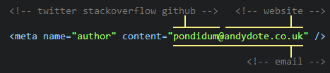
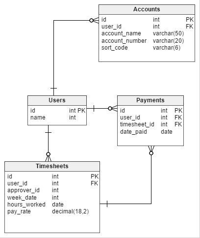
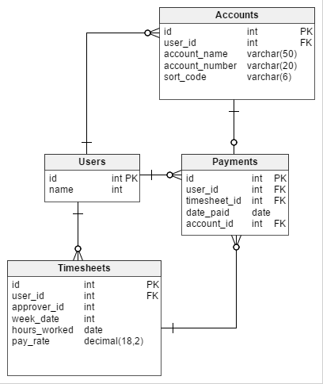

# Event Sourcing
### Andy Davies

# Lets have an example...

Note: bank accounts and shopping carts are getting tired, and are a little simple.

Note:
works to start with, but has problems:
* the user changes bank account
* the user wants an old payslip re-sending
* someone wants to know which account got paid into for a given week.
Has questions we cannot answer too:
* was the timesheet approved first time, or did it take multiple goes?
* does this happen often for a given user?
* does this happen often for a given approver?

Note:
* One solution is to link payments to the account paid
* However this doesnt haelp if the accounts detail gets modified
* You could solve this with your domain enforcing copy-on-write semantics
* could also have an audit/history table
  * seen this done with some nasty triggers
* cant apply this historically

* TimesheetGenerated
* UserUpdatedTimesheet
* UserSubmittedTimesheet
* TimesheetApproved
* TimesheetRejected
* UserPaid

Note: represent the domain as a set of events

* TimesheetGenerated <!-- .element: class="fragment" -->
* UserUpdatedTimesheet <!-- .element: class="fragment" -->
* UserSubmittedTimesheet <!-- .element: class="fragment" -->
* TimesheetRejected <!-- .element: class="fragment" -->
* UserUpdatedTimesheet <!-- .element: class="fragment" -->
* UserSubmittedTimesheet <!-- .element: class="fragment" -->
* TimesheetApproved <!-- .element: class="fragment" -->
* PaymentQueued <!-- .element: class="fragment" -->
* UserPaid <!-- .element: class="fragment" -->
