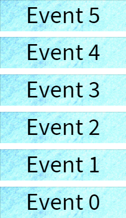
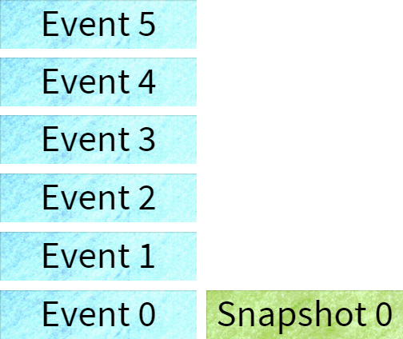

# Event Sourcing
### Andy Davies


Note:
* A different way of storing data
* Requires a little more thought to implement
* Lossless storage - you can transform to any other datastore type
* Guaranteed audit log
* Allows historic questions to be answered
* Events are something which happened - they must be named in the past-tense


```json
{
  "type": "address_changed",
  "line1": "9 Home Road",
  "town": "Home Town",
  "county": "Dorset",
  "postcode": "BH22 7LF"
}
```
Note:
* Events capture intent as well as the change
* This is a bad event


```json
{
  "type": "user_moved_house",
  "line1": "9 Home Road",
  "town": "Home Town",
  "county": "Dorset",
  "postcode": "BH22 7LF"
}
```

```json
{
  "type": "address_corrected",
  "line1": "9 Home Road",
  "town": "Home Town",
  "county": "Dorset",
  "postcode": "BH22 7LF"
}
```
Note:
* Events have the same data
* events have different intent


# Lets have an example...

Note: bank accounts and shopping carts are getting tired, and are a little simple.


Note:
works to start with, but has problems:
* the user changes bank account
* the user wants an old payslip re-sending
* someone wants to know which account got paid into for a given week.
Has questions we cannot answer too:
* was the timesheet approved first time, or did it take multiple goes?
* does this happen often for a given user?
* does this happen often for a given approver?


Note:
* One solution is to link payments to the account paid
* However this doesnt haelp if the accounts detail gets modified
* You could solve this with your domain enforcing copy-on-write semantics
* could also have an audit/history table
  * seen this done with some nasty triggers
* cant apply this historically


* TimesheetGenerated
* UserUpdatedTimesheet
* UserSubmittedTimesheet
* TimesheetApproved
* TimesheetRejected
* UserPaid

Note: represent the domain as a set of events


`TimesheetGenerated: { weekdate: 2016-06-20 }` <!-- .element: class="fragment" -->

`UserUpdatedTimesheet: { hours_worked: 48 }` <!-- .element: class="fragment" -->

`UserSubmittedTimesheet: { }` <!-- .element: class="fragment" -->

`TimesheetRejected: { }` <!-- .element: class="fragment" -->

`UserUpdatedTimesheet: { hours_worked: 40 }` <!-- .element: class="fragment" -->

`UserSubmittedTimesheet: { }` <!-- .element: class="fragment" -->

`TimesheetApproved: { }` <!-- .element: class="fragment" -->

`PaymentQueued: { account: { ... }, value: 400.00 }` <!-- .element: class="fragment" -->

`UserPaid: { value: 400.00 }` <!-- .element: class="fragment" -->

Note: all events have the current user and timestamp logged against them


 <!-- .element: class="no-border" -->
Note: conceptual only


 <!-- .element: class="no-border" -->


```sql
select snapshotType, snapshot
from snapshots
where aggregateID = @id
order by sequence desc
limit 1

select e.eventType, e.event
from events e
where e.aggregateID = @id
  and e.sequence > (
    select max(s.sequence)
    from snapshots s
    where s.aggregateID = @id
  )
order by e.sequence asc
```


Note:
* How do we handle searching?
* One model for each purpose
* Can also be stored in different places, e.g. sql, elasticsearch, redis


*All Timesheets*
```json
{
  "id": 12345,
  "name": "Andy Davies",
  "timesheets": [
    {
      "id": 1,
      "week_date": "2016-06-06",
      "state": "paid",
      "hours_worked": 40,
      "pay_rate": 10.00
    },
    {
      "id": 2,
      "week_date": "2016-06-13",
      "state": "submitted",
      "hours_worked": 40,
      "pay_rate": 10.00
    },
  ]
}
```
<!-- .element: class="stretch" -->


*All Timesheets Awaiting Approval*
```json
{
  "id": 2,
  "week_date": "2016-06-13",
  "hours_worked": 40,
  "pay_rate": 10.00,
  "user": { "id": 12345, "name": "Andy Davies" },
  "authoriser": { "id": 998, "name": "Dave Johns" }
},
{
  "id": 5,
  "week_date": "2016-06-13",
  "hours_worked": 20,
  "pay_rate": 15.00,
  "user": { "id": 543, "name": "Cloud Strife" },
  "authoriser": { "id": 997, "name": "Alice Michaels" }
}
```


*All Actionable Timesheets for an Authoriser*
```json
[
  {
    "id": 2,
    "week_date": "2016-06-13",
    "hours_worked": 40,
    "pay_rate": 10.00,
    "user": { "id": 12345, "name": "Andy Davies" },
  },
]
```


Note:
* this is done in a ddd fashion - e.g. methods to change things, rather than direct collection access.
* also proper encapsulation


```c#
public class Timesheet
{
  public static Timesheet Generate(User user, WeekDate week, PayRate pay)
  {
    if (week < DateTime.UtcNow) throw new InvalidWeekException(week);

    var ts = new Timesheet();
    ts.Apply(new TimesheetGenerated(user, week, pay))

    _emailService.Send(new TimesheetNotification(ts));

    return ts;
  }

  private void Handles(TimesheetGenerated e)
  {
    User = e.User;
    WeekDate = e.WeekDate;
    PayRate = e.Pay;
  }
}
```
<!-- .element: class="stretch" -->
Note:
* We use a static method for construction to make methods naming more explicit
* wouldn't want email sent every time you load


```c#
public void SubmitForApproval()
{
  Apply(new UserSubmittedTimesheet());
}

private void Handles(UserSubmittedTimesheet e)
{
  Status = TimesheetStatus.Submitted;
}
```
<!-- .slide: data-transition="none-out" -->
Note: if we start with this, the logic and validation go into the "apply" method


```c#
public void SubmitForApproval()
{
  _approverService.Validate(this);    //throws on no approver etc.
  _approverService.Submit(this);

  Apply(new UserSubmittedTimesheet());
}

private void Handles(UserSubmittedTimesheet e)
{
  Status = TimesheetStatus.Submitted;
}
```
<!-- .slide: data-transition="none-in" -->
Note:
* when an event gets applied we don't want side effects
