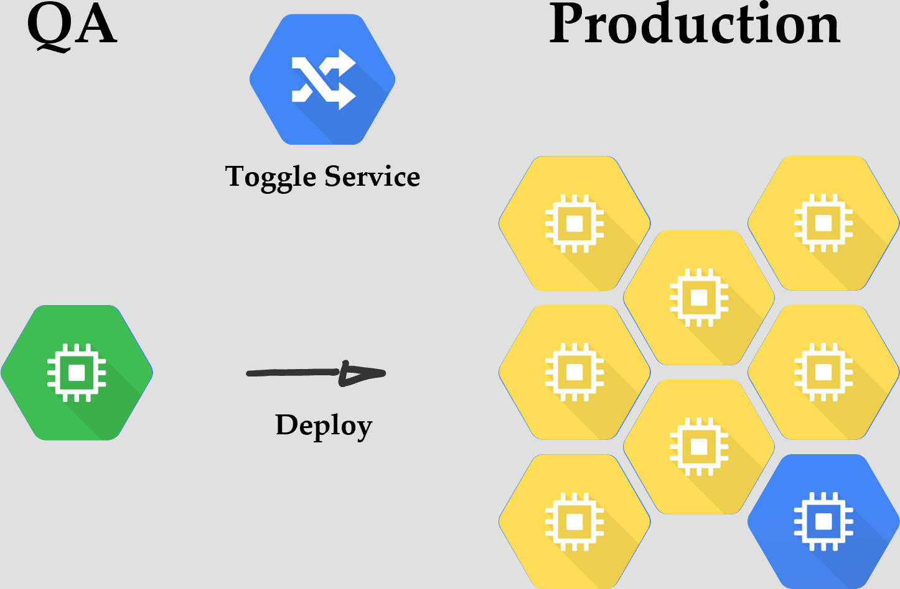
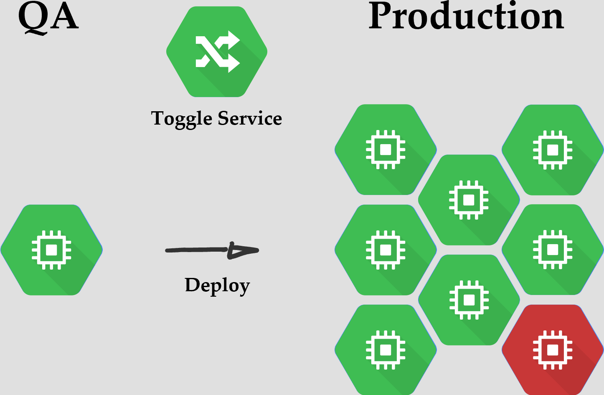
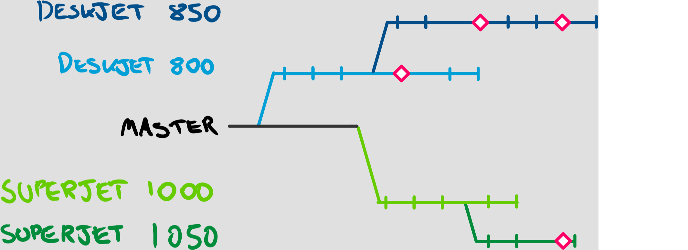
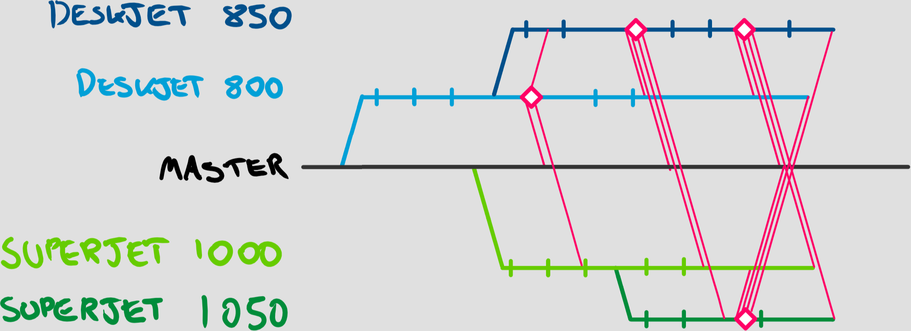
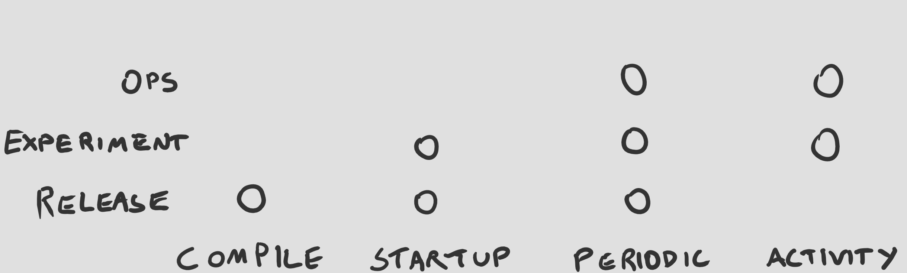
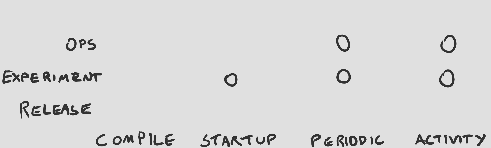
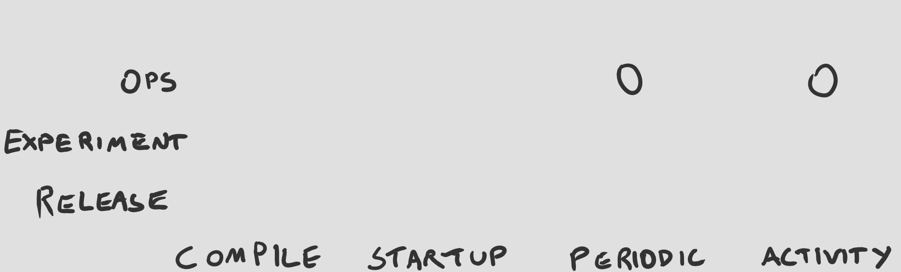
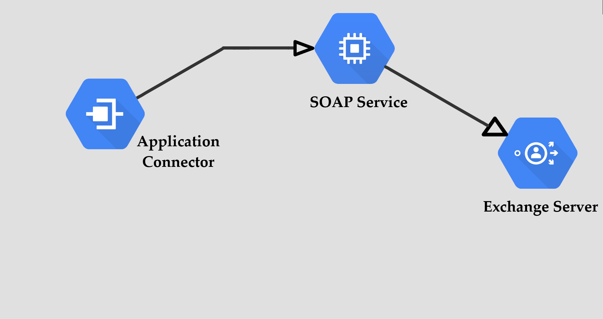
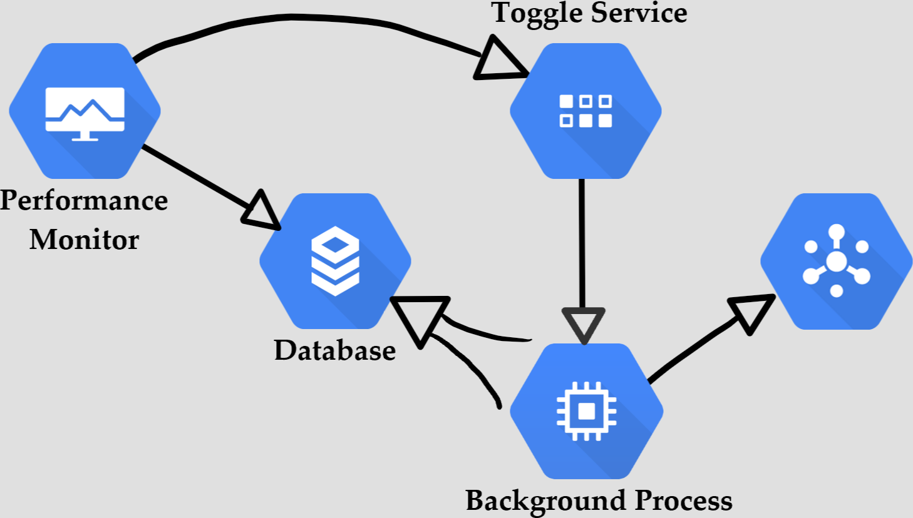

# Feature Toggles <!-- .element: class="push-down stroke" -->
## Andy Davies <!-- .element: class="stroke" -->
github.com/pondidum | @pondidum | andydote.co.uk  <!-- .element: class="smaller" -->

https://www.reddit.com/r/gaming/comments/692hqa/mccree_looking_good_in_ac_black_flag/dh3gu1a/ <!-- .element: class="attribution" -->

<!-- .slide: data-background="img/good-bad-ugly.png" data-background-size="contain" class="gbu" -->


 <!-- .element: class="no-border" -->
https://en.wikipedia.org/wiki/File:Knight_Capital_Group_logo.svg <!-- .element: class="attribution" -->
Note:
* Who has heard of a company called Knight Capital?
* Ok, and *why* have you heard of them?
* American global financial services firm, doing market-making, trading
* They had a "slight" hiccup involving deployment and feature toggling
* on the day in question, they had $365 million in cash and equivalents


https://infocus.dellemc.com/dave_bagatelle/knight-capital-group-kcg-a-lesson-on-the-importance-of-sdlc-and-multi-environment-multi-user-testing/ <!-- .element: class="attribution" -->
Note:
* this is their shareprice
* that is a logarithmic graph
* look at that drop...


## SMARS and PowerPeg
Note:
* SMARS (split big orders into smaller ones)
* Powerpeg: counts shares against an order, stops orders once parent fulfilled. tracking had been moved earlier in pipeline, so powerpeg couldnt count. unused 8 years.


 <!-- .element: class="no-border" -->
https://cloud.google.com/icons/ <!-- .element: class="attribution" -->
<!-- .slide: data-transition="slide-in none-out" -->


 <!-- .element: class="no-border" -->
https://cloud.google.com/icons/ <!-- .element: class="attribution" -->
<!-- .slide: data-transition="none" -->


 <!-- .element: class="no-border" -->
https://cloud.google.com/icons/ <!-- .element: class="attribution" -->
<!-- .slide: data-transition="none" -->


 <!-- .element: class="no-border" -->
https://cloud.google.com/icons/ <!-- .element: class="attribution" -->
<!-- .slide: data-transition="none" -->


 <!-- .element: class="no-border" -->
https://cloud.google.com/icons/ <!-- .element: class="attribution" -->
<!-- .slide: data-transition="none-in slide-out" -->

Note:
* 45mins toggle disabled
* $365 million in assets to start with
* the lost $450 million in 45 minutes


# Dead Code
Note:
* why is it still there!?
* delete it
* source-control history
* trunk based: deploy version with only the removal


#### Lesson 1
## NEVER Reuse A Toggle
Note:
* if they had a new toggle, problem wouldnt have happened


 <!-- .element: class="no-border" -->


#### Lesson 2
## Name Toggles Well


* `EnablePowerPeg`
* `PAY-123`
* `NewFeature`
* `SmarsActive`

<!-- .element: class="list-unstyled list-spaced" -->


 <!-- .element: class="no-border" -->
Note:
* compile: debug only
* startup: microservices, bounce them
* periodic: background
* activity: usually actually background


 <!-- .element: class="no-border" -->
https://en.wikipedia.org/wiki/File:Hewlett-Packard_logo.svg <!-- .element: class="attribution" -->
Note:
* hp printers
* 400-800 devs, 10+ million loc
* 2x releases per year
* 5% features
* 8 weeks for feedback (6 weeks manual integration)


 <!-- .element: class="no-border" -->
<!-- .slide: data-transition="slide-in none-out" -->
Note:
* branch per printer model
* `ifdefs` everywhere
* build per branch


 <!-- .element: class="no-border" -->
<!-- .slide: data-transition="none-in slide-out" -->
Note:
* port fixes (not configs) to all branches


 <!-- .element: class="no-border" -->
Note:
* compile-time to run-time toggles
* trunk based development
* Single branch
* config file with printer capabilities


>Getting rid of code branching will often be your biggest efficiency gain

https://itrevolution.com/the-amazing-devops-transformation-of-the-hp-laserjet-firmware-team-gary-gruver/ <!-- .element: class="attribution" -->
Note:
* using branches as feature toggles
* toggles were fairly static, so a config file in the repo
* branching by abstraction


#### Lesson 3
## Architecture Matters
Note:
* toggles should be implemented smartly
* dont spatter the same if statement everywhere


## Toggle Types
Note:
* many dimensions to toggles
* how often it changes (static -> dynamic)
* how specific (user/group/all)


  <!-- .element: class="no-border" -->
<!-- .slide: data-transition="slide-in none-out" -->
Note:
* the feature toggle


  <!-- .element: class="no-border" -->
<!-- .slide: data-transition="none" -->
Note:
* AB testing


  <!-- .element: class="no-border" -->
<!-- .slide: data-transition="none" -->
Note:
* Performance
* Possibly automated toggling
* (the only) longer life toggle


  <!-- .element: class="no-border" -->
<!-- .slide: data-transition="none" -->
Note:
* can a user do something?


  <!-- .element: class="no-border" -->
<!-- .slide: data-transition="none" -->
Note:
* compile: rare. sqlprofiler, things CANNOT be in prod
* startup: microservices > websites
* periodic: background updated
* activity: checked every action, uses background probably


  <!-- .element: class="no-border" -->
<!-- .slide: data-transition="none" -->
Note:
* compile time not great, needs redeploy
* startup: change toggle, bounce service
* periodic: change toggle, wait


  <!-- .element: class="no-border" -->
<!-- .slide: data-transition="none" -->
Note:
* to a subset of users, usually
* scale (risk): large=activity, small=startup


  <!-- .element: class="no-border" -->
<!-- .slide: data-transition="none" -->
Note:
* effects everyone
* periodic check most likely


  <!-- .element: class="no-border" -->
<!-- .slide: data-transition="none" -->
Note:
* can a user/group do something?
* activity/background
* but...


  <!-- .element: class="no-border" -->
<!-- .slide: data-transition="none slide-out" -->
Note:
* dont!
* toggles != authorization


# Toggles are bad because...
Note:
* common reasons
* horror stories covered!


### ...I dont want this everywhere
```csharp
if (_toggles.PowerPeg.Enabled)) {
    // ...
}
```
Note:
* good!
* Lesson 3: Architecture Matters
* HP got this right, Knight Capital...didn't


# Branch By Abstraction


```csharp
var container = new Container(c =>
{
    if (_toggles.EmailDispatchQueue.Enabled)
        c.For<IEmailConnector>().Use<RabbitMqConnector>();
    else
        c.For<IEmailConnector>().Use<WebServiceConnector>();
});
```
Note:
* great for startup toggles!


```csharp
public class EmailConnectorRouter : IEmailConnector
{
    public EmailConnectorRouter(
        IToggles toggles,
        IEmailConnector whenEnabled,
        IEmailConnector whenDisabled)
    {
    }

    public Task Dispatch(EmailMessage message)
    {
        if (_toggles.EmailDispatchQueue.Enabled)
            return _whenEnabled.Dispatch(message);
        else
            return _whenDisabled.Dispatch(message);
    }
}
```
Note:
* better for periodic or activity
* could be a factory also
* what about the frontend?


```javascript
import  { toggled } from 'react-toggles' //this doesn't exist!

const OneClickBuyButton = buyItem => <a onClick={buyItem}>Buy Now!</a>;

export default toggled(toggles.OneClickEnabled)(OneClickBuyingButton)
```
Note:
* React
* react-toggles is invented!


# Testing is harder
Note:
Is it?


 <!-- .element: class="no-border" -->
<!-- .slide: data-transition="out-none" -->
Note:
* greg young: tests are immutable
* old tests don't change (toggle off)


 <!-- .element: class="no-border" -->
<!-- .slide: data-transition="in-none" -->
Note:
* new tests (toggle on)
* delete old when toggle removed!
* manual testing basically the same


# Adds Complexity
Note:
* but what doesn't?
* at a previous job...


 <!-- .element: class="no-border" -->
<!-- .slide: data-transition="out-none" -->
Note:
* monolith repo
* 2x inhouse, 1x outsourced (incompetent)
* day to day work
* external branch always out of date


 <!-- .element: class="no-border" -->
<!-- .slide: data-transition="in-none" -->
Note:
* priorities changed
* multiple merge and revert
* rebases!


## Additional Complexity
Note:
* branching by abstraction itself is good design
* don't have a long lived toggle
* when to remove?


#### Lesson 4
## Monitor Toggles
Note:
* queried
* state change


 <!-- .element: class="no-border" -->
Note:
* we can see a toggle stopped being queried
* and this one hasn't changed state


# The Good
Note:
* phased rollout of a feature


 <!-- .element: class="no-border" -->
<!-- .slide: data-transition="out-none" -->
Note:
* soap service was crap
* did magic also
* exchange random slowdowns


 <!-- .element: class="no-border" -->
<!-- .slide: data-transition="out-none" -->
Note:
* magic was implemented properly in other pipeline connector
* IEmailConnector, decorator to choose impl
* default/toggle off = old


 <!-- .element: class="no-border" -->
<!-- .slide: data-transition="in-none" -->
Note:
* toggle on, queues
* rabbitmq plus a couple of workers


 <!-- .element: class="no-border" -->
<!-- .slide: data-transition="none" -->
Note:
* picked person who got most problems
* asked him to beta test (keen!)
* toggle a few times based on feedback


 <!-- .element: class="no-border" -->
<!-- .slide: data-transition="none" -->
Note:
* added teammate


 <!-- .element: class="no-border" -->
<!-- .slide: data-transition="none" -->
Note:
* perf issues found!


 <!-- .element: class="no-border" -->
<!-- .slide: data-transition="none" -->


 <!-- .element: class="no-border" -->
<!-- .slide: data-transition="none" -->
Note:
* Worker reads both queues
* favours direct queue
* competing workers added later


 <!-- .element: class="no-border" -->
<!-- .slide: data-transition="none" -->
Note:
* no new problems...


 <!-- .element: class="no-border" -->
<!-- .slide: data-transition="none" -->
Note:
* no new problems...


 <!-- .element: class="no-border" -->
<!-- .slide: data-transition="in-none" -->
Note:
* process took 6-8 weeks
* faster towards the end
* toggle deleted another 4 weeks later


 <!-- .element: class="no-border" -->
Note:
* background process could cause load
* usually not the root cause
* monitoring started off manual


## Toggles Promote Experimentation
Note:
* A/B testing on a subset of users
* similar to phased rollout
* monitoring required for this one!
* use Scientist or similar!


## Questions?


github.com/pondidum | twitter.com/pondidum | andydote.co.uk  <!-- .element: class="small" -->
