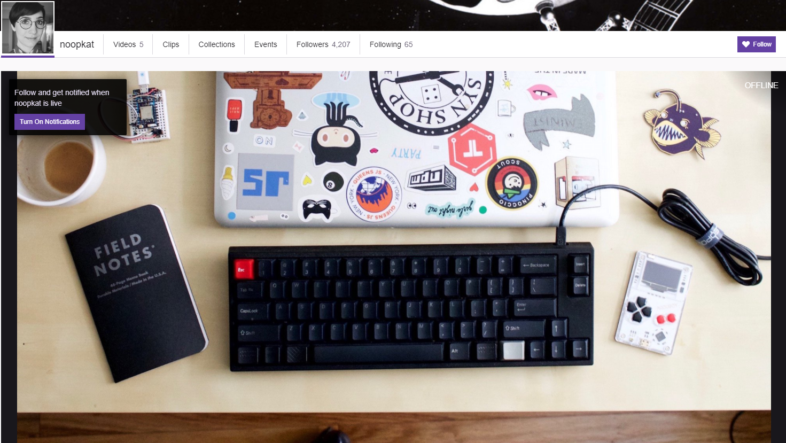
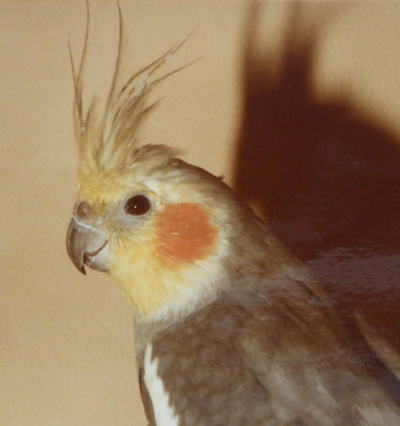
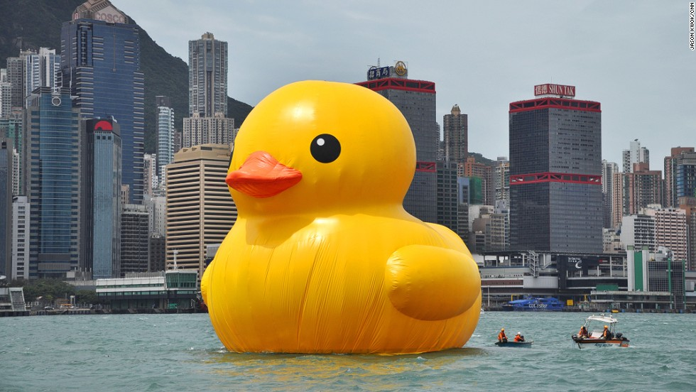
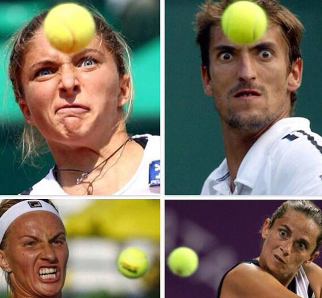
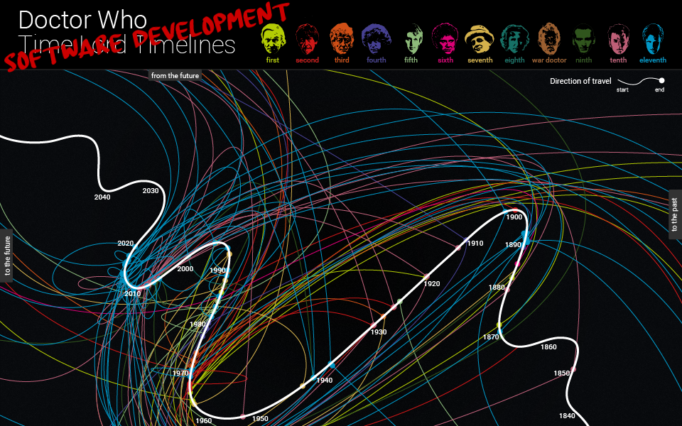
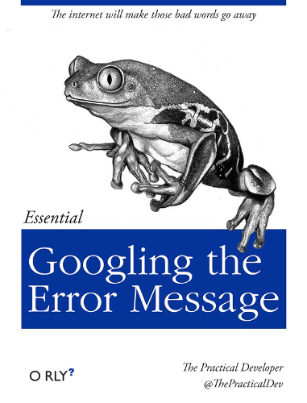

## Streaming Development
##for fun and ...?
 
 
#### Andy Davies

github.com/pondidum | twitch.tv/pondidum | twitter.com/pondidum | andydote.co.uk  <!-- .element: class="small" -->

Note:
* normally I talk about technical topics; Architecture, design patterns, domain design etc.
* so when Arado asked me if I would like to speak here again, and what would I like to talk about, I said I have lightning talks on feature toggling, automation or eventsoucing
* a little later the response came back: "how do you feel about talking about your experiences streaming?"
* so naturally I said sure, why not.
* So here is my talk on streaming dotnet Development

 <!-- .element: class="no-border" -->
https://app.twitch.tv/ <!-- .element: class="attribution" -->

Note:
* I started streaming x weeks ago on twitch
* so far, the experience has been pretty fun
* helps me focus (You can't just wander off and stare into space while streaming...)
* but lets take a step back.  why did I decide to do this?
* after the first couple of streams, I figured it would be fun to follow a project, from start to finish.
* not a problem finding a project, I have hundreds of ideas I never get around to!

## But why?
1. Start streaming<!-- .element: class="fragment" -->
2. ...<!-- .element: class="fragment" -->
3. Profit!<!-- .element: class="fragment" -->

Note:
* people usually set out to do something
* normally the steps are...

Note:
* but in my case, I saw an article by Suz Hinton about streaming nodejs hardware dev
* thought it sounded fun
* streaming I mean, not javascript and hardware
* although...

1. Start Streaming &#10004;
2. ...<!-- .element: class="fragment" -->
3. ...<!-- .element: class="fragment" -->

Note:
* So I gave it a go
* step 1 complete!
* step 2 - dunno
* step 3 - dunno
* so I dont have any steps...but I am having fun!

Photo: Courtesy of my father <!-- .element: class="attribution" -->

Note:
* I picked an idea I had for a while: a restful, eventsourced feature toggling service
* Which I have called Crispin.
* as one of the use of toggles is canary releasing, I named the project after the cockatiel we had when I was a child.
* pic related, is him

By Kate Whitehead, for CNN |<!-- .element: class="attribution" --> https://www.thebigduck.us/

Note:
* who knows the phrase Rubber Ducking?
* explaining a problem to a rubber duck helps.
* speech != thoughts

http://imgur.com/EQZJ2Jt <!-- .element: class="attribution" -->

Note:
* Concentration!
* Tennis players close ups look like people concentrating on telekinetic powers...
* I have a habit of getting distracted
* You can't just wander off and browse imgur on your phone while streaming!

http://www.bbc.com/future/bespoke/doctorwho50/ <!-- .element: class="attribution" -->

Note:
* I can see how long a project takes!

http://www.boyter.org/2016/04/collection-orly-book-covers/ <!-- .element: class="attribution" -->

Note:
* chat can be helpful when you get stuck
* someone helped me out with operator overloads
* Get a lot of repeated questions

* What are you building? <!-- .element: class="talk-bubble" -->
* Do you like Rider? <!-- .element: class="talk-bubble fragment" -->
* Why aren't you using Visual Studio? <!-- .element: class="talk-bubble fragment" -->
* Do you like dotnet core? <!-- .element: class="talk-bubble fragment" -->
* Why do you use a Finnish keyboard? <!-- .element: class="talk-bubble fragment" -->

<!-- .element: class="list-unstyled" -->
Note:
* added a chat command "!what" to help with what I am building

## Questions?

github.com/pondidum | twitch.tv/pondidum | twitter.com/pondidum | andydote.co.uk  <!-- .element: class="small" -->
