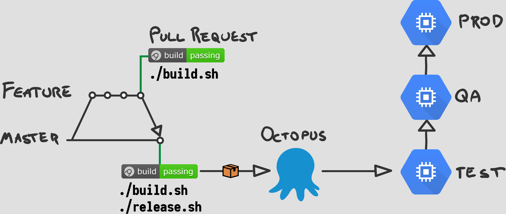

# 12 Factor Microservices <!-- .element: class="stroke white" -->
<br />
## Andy Davies <!-- .element: class="stroke white" -->
github.com/pondidum | @pondidum | andydote.co.uk  <!-- .element: class="smaller white" -->

http://cdn.wonderfulengineering.com/wp-content/uploads/2014/06/Engineering-pictures-2.jpg <!-- .element: class="attribution white" -->

<!-- .slide: data-background="img/gears.jpg" data-background-size="" class="intro" -->


# Why should I care?
Note:
* Originally written by Heroku
* Set of principals for building software
* aims to make it
  * consistent
  * portable
  * scalable
  * declarative


## 1. Codebase
One codebase tracked in revision control, many deploys
Note:
* 1 to 1 mapping repos to services
* where is service x? in repo named x
* mutliple codebases means not app, but system


# But x uses a monorepo
Note:
* Google, Facebook, Microsoft use monorepo
* you are not their scale
* 2 of them have written filesystems to deal with it
* perhaps they are solving the wrong problem?


## 2. Dependencies
Explicitly declare and isolate dependencies
Note:
* use nuget/package manager
* dont rely on system packages
* in dotnet this means no GAC!


```csharp
Process.Start("dig @127.0.0.1 some.other.service +short");
```
Note:
* shelling out to system utilities is banned too
* include local version in your build


## 3. Config
Store config in the environment
Note:
* this means environment variables...
* no app.configs...?


# Don't Store
* Connection Strings
* Passwords
* ApiKeys

<!-- .element: class="list-unstyled list-spaced" -->
Note:
* anything sensitive
* should be centralised


 <!-- .element: width="50%" class="no-border" -->
 <!-- .element: width="50%" class="no-border fragment" -->
https://www.hashicorp.com/brand <!-- .element: class="attribution" -->


## 4. Backing services
Treat backing services as attached resources
Note:
* anything over the network
* in-house database
* 3rd party api (e.g. Twilio, S3)
* no-code changes to change (see F3)


## 5. Build, Release, Run
Strictly separate build and run stages
Note:
* no modifying things in prod!
* build.sh, release.sh, deploy...


 <!-- .element: class="no-border" -->


```shell
./build.sh --config Release
./release.sh --apikey $OCTOPUS_KEY
```


## 6. Process
Execute the app as one or more stateless processes
Note:
* state in a backing service (e.g. db)
* dont assume memory or disk last more than one operation


## 7. Port Binding
Export services via port binding
Note:
* harder before dotnet core
* could do it with OWIN though (but ssl nightmare)
* webserver, nginx/iis as reverse proxy
* not just for http (xmpp etc)


## 8. Concurrency
Scale out via the process model
Note:
* split by work type (http, rabbitmq, background indexing)
* doesn't ban threads
* but you should be able to run multiple copies for scale-out


## Questions?


github.com/pondidum | twitter.com/pondidum | andydote.co.uk  <!-- .element: class="small" -->
