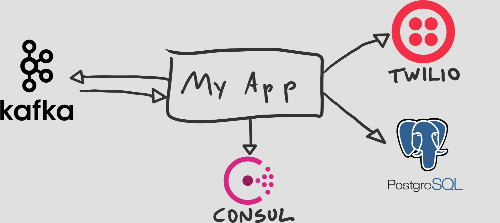
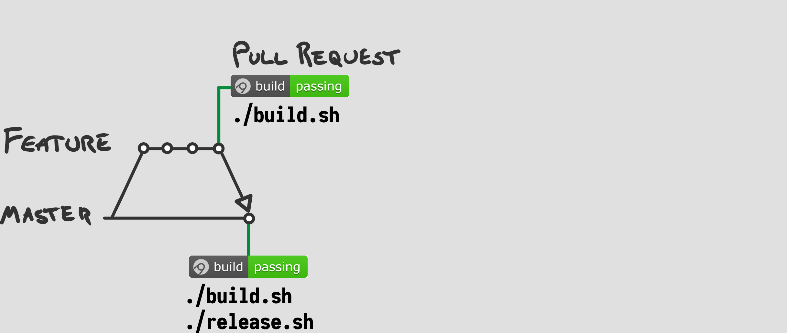

# 12 Factor Microservices <!-- .element: class="stroke white" -->
<br />
## Andy Davies <!-- .element: class="stroke white" -->
github.com/pondidum | @pondidum | andydote.co.uk  <!-- .element: class="smaller white" -->

http://cdn.wonderfulengineering.com/wp-content/uploads/2014/06/Engineering-pictures-2.jpg <!-- .element: class="attribution white" -->

<!-- .slide: data-background="img/gears.jpg" data-background-size="" class="intro" -->

Note:
* Originally written by Heroku
* Set of principals for building software
* aims to make it
  * consistent
  * portable
  * scalable
  * declarative
* There are some tradeoffs and dissagreements


## 1. Codebase
One codebase tracked in revision control, many deploys
Note:
* 1 to 1 mapping repos to services
* where is service x? in repo named x
* mutliple codebases means not app, but system


# But <!-- .element: class="no-border" style="vertical-align:middle;" --> use a monorepo
Note:
* Google, Facebook, Microsoft use monorepo
* you are not their scale
* 2 of them have written filesystems to deal with it
* perhaps they are solving the wrong problem?


 <!-- .element: class="no-border" -->


 <!-- .element: class="no-border" -->
<!-- .slide: data-transition="slide-in none-out" -->
Note:
* what about common things?
* terraform
* acceptance tests?


 <!-- .element: class="no-border" -->
<!-- .slide: data-transition="none-in slide-out" -->
Note:
* one solution
* extra project for shared stuff
* acceptance tests
* generates 3 artifacts


 <!-- .element: class="no-border" -->
Note:
* shared code? e.g. models
* nugets
  * on nuget feed?
  * only used by this?
* acceptance tests
  * event > consumer > api > bacground


## 2. Dependencies
Explicitly declare and isolate dependencies
Note:
* use nuget/package manager
* dont rely on system packages
* in dotnet this means no GAC!


```csharp
Process.Start("dig @127.0.0.1 some.other.service +short");
```
Note:
* shelling out to system utilities is banned too
* include local version in your build


## 3. Config
Store config in the environment
Note:
* this means environment variables...
* no app.configs...?


```bash
dotnet add package Microsoft.Extensions.Configuration
dotnet add package Microsoft.Extensions.Configuration.Binder
dotnet add package Microsoft.Extensions.Configuration.EnvironmentVariables
```
```csharp
public static IWebHost BuildWebHost(string[] args) => WebHost
    .CreateDefaultBuilder(args)
    .UseStartup<Startup>()
    .ConfigureServices(services =>
    {
        services.AddSingleton(new ConfigurationBuilder()
            .AddEnvironmentVariables(ev => ev.Prefix = "twelve:")
            .Build()
            .Get<Configuration>()
        );
    })
    .Build();
```
<!-- .element: class="fragment" -->
Note:
* add 3 packages
* using aspnetcore.all gives first 2 already
* not using `ConfigureAppConfiguration`
* strong config best config


```csharp
public class Configuration
{
    public string PostgresConnection { get; set; }
    public string DatabaseName { get; set; }

    public Uri RabbitHost { get; set; }
    public string RabbitUsername { get; set; }
    public string RabbitPassword { get; set; }
}
```


# Don't Store Sensitive Data in the Environment
Note:
* Connection Strings
* Passwords
* ApiKeys
* should be centralised


 <!-- .element: width="50%" class="no-border" -->
 <!-- .element: width="50%" class="no-border fragment" -->
https://www.hashicorp.com/brand <!-- .element: class="attribution" -->
Note:
* connection strings in consul
* but username and pwd in vault
    * which stores in consul...


```bash
dotnet add package Consul.Microsoft.Extensions.Configuration
```
```csharp
public static IWebHost BuildWebHost(string[] args) => WebHost
    .CreateDefaultBuilder(args)
    .UseStartup<Startup>()
    .ConfigureServices(services =>
    {
        services.AddSingleton(new ConfigurationBuilder()
            .AddEnvironmentVariables(ev => ev.Prefix = "twelve:")
            .AddConsul(prefix: "appsettings/twelve/")
            .Build()
            .Get<Configuration>()
        );
    })
    .Build();
```
<!-- .element: class="fragment" -->


## 4. Backing Services
Treat backing services as attached resources
Note:
* bit obtuse...what does it mean?


 <!-- .element: class="no-border" -->
Note:
* anything over the network
* kafka: who knows where it is!
* postgres: on premise, RDS, etc.
* twilio: definitely not self hosted!
* no-code changes to change (see F3)


## 5. Build, Release, Run
Strictly separate build and run stages
Note:
* no modifying things in prod!
* build.sh, release.sh, deploy...


 <!-- .element: class="no-border" -->
<!-- .slide: data-transition="slide-in none-out" -->


```bash
MODE=${1:-Debug}
NAME=$(basename $(ls *.sln | head -n 1) .sln)

dotnet build --configuration $MODE

find ./src -iname "*.Tests.csproj" -type f -exec \
  dotnet test --configuration $MODE --no-build --no-restore "{}" \;

dotnet publish \
  --configuration $MODE --no-build --no-restore
  --output ../../.build/publish

octo pack \
  --basePath .build/publish
  --outFolder .build/artifacts
  --id $NAME
  --version $(readVersion.sh $NAME)
```
Note:
* we deploy with octopus, so generate a nuget for apps
* you could create a docker container
* bake an ami with packer etc.
<!-- .slide: data-transition="fade" -->


 <!-- .element: class="no-border" -->
<!-- .slide: data-transition="none-in none-out" -->
Note:
* pr accepted
* runs build.sh and release.sh


```bash
APIKEY="$1"
find .build/artifacts -iname "*.nupkg" -exec octo push \
  --package "{}" \
  --server https://octopus.internal.net \
  --apiKey $APIKEY \
  \;
```

```bash
CONTAINER=$(docker images | grep myapp | grep latest | awk '{print $3}')

docker tag $CONTAINER docker.internal.net/myapp
docker push docker.internal.net/myapp
```
<!-- .element: class="fragment" -->
<!-- .slide: data-transition="fade" -->


 <!-- .element: class="no-border" -->
<!-- .slide: data-transition="none-in none-out" -->


 <!-- .element: class="no-border" -->
<!-- .slide: data-transition="none-in none-out" -->


 <!-- .element: class="no-border" -->
<!-- .slide: data-transition="none-in slide-out" -->


## 6. Process
Execute the app as one or more stateless processes
Note:
* state in a backing service (e.g. db)
* dont assume memory or disk last more than one operation


# Caching?
Note:
* single operation only
* multiple copies, low hit rate
* maybe in-memory cache where it makes sense
* don't require it however


## 7. Port Binding
Export services via port binding
Note:
* Completely self contained
* bind to a port, service requests
* not just for http!
  * xmpp
  * kafka etc
* no IIS!


 <!-- .element: class="no-border" -->
* XML Configuration! <!-- .element: class="fragment" -->
* Complexity! <!-- .element: class="fragment" -->
* Killing AppPools at random! <!-- .element: class="fragment" -->
* SSL Termination <!-- .element: class="fragment" -->

<!-- .element: class="list-unstyled list-spaced center" -->
Note:
* before core, owin and netsh is not fun
* configuring reverse proxy...


 <!-- .element: class="no-border" -->
Note:
* bind to port x on localhost
* https offload on nginx or other webserver


```csharp
public class Program
{
    public static void Main(string[] args)
    {
        WebHost
            .CreateDefaultBuilder(args)
            .UseStartup<Startup>()
            .UseUrls("http://localhost:1234") //optional force port
            .Build()
            .Run();
    }
}
```
Note:
* standard .netcore startup
* added `UseUrls` to force port
* don't publish this url to consul for service discovery!


```nginx
server {
    listen                    *:443 ssl;
    server_name               example.com;
    ssl_certificate           /etc/ssl/certs/testCert.crt;
    ssl_certificate_key       /etc/ssl/certs/testCert.key;
    ssl_protocols             TLSv1.1 TLSv1.2;
    ssl_prefer_server_ciphers on;
    ssl_ciphers               "EECDH+AESGCM:EDH+AESGCM:AES256+EECDH:AES256+EDH";
    ssl_ecdh_curve            secp384r1;
    ssl_session_cache         shared:SSL:10m;
    ssl_session_tickets       off;

    location / {
        proxy_pass  http://localhost:1234;
    }
}
```
https://docs.microsoft.com/en-us/aspnet/core/host-and-deploy/linux-nginx <!-- .element: class="attribution" -->
Note:
* configure nginx to do ssl offload
* example only!
  * more headers
  * HSTS
  * stapling
* publish this url to consul for service discovery!


```bash
dotnet add package Microsoft.AspNetCore.HttpOverrides
```

```csharp
public class Startup
{
    public void Configure(IApplicationBuilder app, IHostingEnvironment env)
    {
        if (env.IsDevelopment())
            app.UseDeveloperExceptionPage();

        app.UseForwardedHeaders(new ForwardedHeadersOptions
        {
            ForwardedHeaders = ForwardedHeaders.All;
        });

        app.UseAuthentication();
        app.UseMvc();
    }
}
```
<!-- .element: class="fragment" -->
Note:
* add `HttpOverrides`
* call `UseForwardedHeaders`
* Update scheme, host, remoteIpAddress so auth middleware works


 <!-- .element: class="no-border" -->
<!-- .slide: data-transition="slide-in none-out" -->
Note:
* normal state
* maybe aws lb instead of haproxy


 <!-- .element: class="no-border" -->
<!-- .slide: data-transition="none-in fade-out" -->
Note:
* viral post on reddit/hackernews about your new js framework


## 8. Concurrency
Scale out via the process model
<!-- .slide: data-transition="fade" -->
Note:
* split by work type (http, rabbitmq, background indexing)
* doesn't ban threads
* but you should be able to run multiple copies for scale-out


 <!-- .element: class="no-border" -->
<!-- .slide: data-transition="fade-in slide-out" -->
Note:
* more instances!
* be careful of downstream effects


## 9. Disposability
Maximize robustness with fast startup and graceful shutdown
Note:
* quicker it can handle requests the better


<!-- .element: class="no-border" -->
Note:
* shutdown: stop handling new requests, finish current ones
    * cost!
* bouncing service has lower downtime
* a sudden shutdown should not cause data loss


## 10. Dev/prod parity
Keep development, staging, and production as similar as possible
Note:
* first part is infrastructure
* how to keep all envs the same?


 <!-- .element: class="no-border" -->
Note:
* declarative infrastructure


```javascript
resource "aws_db_instance" "storage" {
  allocated_storage    = 10
  storage_type         = "gp2"
  engine               = "postgres"
  instance_class       = "db.t2.micro"

  name                 = "Twelve"
  username             = "${var.db_username}"
  password             = "${var.db_password}"
}
```
Note:
* "make the db in this state"
* creates or updates
* username and pwd from cli/vault/consul


```javascript
resource "aws_ecs_cluster" "main" {
  name = "ecs-cluster"
}
```

```javascript
resource "aws_ecs_task_definition" "api" {
  requires_compatibilities = [ "FARGATE" ]
  cpu                      = 1
  memory                   = 256
  container_definitions    = [ { "image": "${var.app_image}" } ]
}
```

```javascript
resource "aws_ecs_service" "main" {
  name            = "ecs-service"
  cluster         = "${aws_ecs_cluster.main.id}"
  task_definition = "${aws_ecs_task_definition.api.arn}"
  desired_count   = 3
  launch_type     = "FARGATE"

  load_balancer {
    target_group_arn = "${aws_alb_target_group.app.id}"
    container_name   = "twelve.api"
    container_port   = "443"
  }
}
```
Note:
* lookup the ECS Cluster (managed externally)
* create a task for our container (id from cli)
* update our service with the task
* missing lots!


 <!-- .element: class="no-border" -->
<!-- .slide: data-transition="slide-in none-out" -->


 <!-- .element: class="no-border" -->
<!-- .slide: data-transition="none-in slide-out" -->


 <!-- .element: class="no-border" -->
Note:
* changes have small ttl
* smaller changes = faster progression
* sign off?
    * feature toggles
    * short lived please!
* large ttl = conflicts


## 11. Logs
Treat logs as event streams
Note:
* its a datastream (of events)
* dont handle routing at all (e.g. filesystem)
* write to stdout
* pipe to filebeat/fluentd/etc when deployed


```csharp
public static void Main(string[] args)
{
    WebHost.CreateDefaultBuilder(args)
        .UseStartup<Startup>()
        .UseUrls("http://localhost:1234")
        .ConfigureLogging((host, logging) =>
        {
            logging.ClearProviders();
            logging.AddSerilog(new LoggerConfiguration()
                .WriteTo.Console(new JsonFormatter())
                .CreateLogger()
            );
        })
        .Build()
        .Run();
}
```


```json
{
  "Protocol": "HTTP/1.1",
  "Method": "GET",
  "ContentType": null,
  "ContentLength": null,
  "Scheme": "http",
  "Host": "localhost:5000",
  "PathBase": "",
  "Path": "/",
  "QueryString": "",
  "HostingRequestStartingLog":"Request starting HTTP/1.1 GET http://localhost:5000/",
  "EventId": { "Id": 1 },
  "SourceContext": "Microsoft.AspNetCore.Hosting.Internal.WebHost",
  "RequestId": "0HLECL00SACJ5:00000001",
  "RequestPath": "/"
}
```


```bash
$ dotnet myapp.dll
```
```bash
$ dotnet myapp.dll | dotnet serirender.dll
```
<!-- .element: class="fragment" -->
```bash
$ dotnet myapp.dll | filebeat
```
<!-- .element: class="fragment" -->


 <!-- .element: class="no-border" -->
```bash
filebeat.yml
```
```yaml
filebeat:
  prospectors:
    - input_type: stdin
      fields:
        environment: ${ENVIRONMENT:local}
output:
  logstash:
    hosts: [ "logstash.internal.net:5044" ]
```
Note:
* you can do a lot more things here
* we add the `environment` field
    * read from envvars, default to local


## 12. Admin processes
Run admin/management tasks as one-off processes
Note:
* what else would you do?!
* separate exe with cli tasks (migration, status check, smoketest)
* deployed with main app


```bash
$ dotnet Twelve.Tasks.dll
  ---------------------------------------------------------------------------
  Available commands:
  ---------------------------------------------------------------------------
      inspect -> Inspects various items stored by the service
      migrate -> Migrates the Postgres database schema
         gdpr -> Generate a Report on a User, or Annonymise them
    retention -> Purge all unused old data
  ---------------------------------------------------------------------------
```
```
$ dotnet Twelve.Tasks.dll migrate --version 23

Database is currently at version 22.
Running 1 migration...
Done.
```
<!-- .element: class="fragment" -->
Note:
* running the app we can see all commands
* and running the migration itself
* where did the connection string come from?
    * consul of course
    * same config as prod apps
    * higher priv connection though


```bash
dotnet add package Oakton
```
```csharp
public class MigrateInput
{
    [Description("Optionally specify which version to migrate to")]
    public int Version { get; set; }
}
```
<!-- .element: class="fragment" data-fragment-index="1" -->
```csharp
[Description("Migrates the Postgres database schema")]
public class MigrateCommand : OaktonAsyncCommand<MigrateInput>
{
    public MigrateCommand()
    {
        Usage("Migrate to latest version");
        Usage("Migrate to a specific version").Arguments(x => x.Version);
    }

    public override async Task<bool> Execute(MigrateInput input)
    {
        // Fluent Migrator etc...
        return true;
    }
}
```
<!-- .element: class="fragment" data-fragment-index="1" -->
Note:
* cli gets mapped to the input class
* the command name is the top level action name


## Questions?
<br />

* https://github.com/pondidum/12factor-demo
* https://andydote.co.uk/presentations/twelve-factor
* https://12factor.net/
* https://www.consul.io/
* https://www.terraform.io/
* https://www.vaultproject.io/
* https://docs.microsoft.com/en-us/aspnet/core/host-and-deploy/linux-nginx

<!-- .element: class="list-spaced small" -->
<br />

github.com/pondidum | twitter.com/pondidum | andydote.co.uk  <!-- .element: class="small" -->
