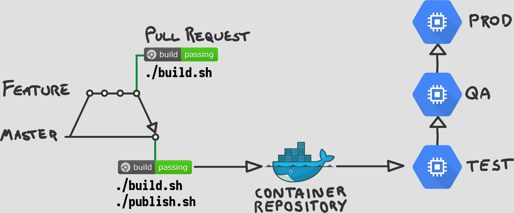

# 12 Factor Microservices <!-- .element: class="stroke white" -->
<br />
## Andy Davies <!-- .element: class="stroke white" -->
github.com/pondidum | @pondidum | andydote.co.uk  <!-- .element: class="smaller white" -->

http://cdn.wonderfulengineering.com/wp-content/uploads/2014/06/Engineering-pictures-2.jpg <!-- .element: class="attribution white" -->

<!-- .slide: data-background="img/gears.jpg" data-background-size="" class="intro" -->

Note:
* Originally written by Heroku
* Set of principals for building software
* aims to make it
  * consistent
  * portable
  * scalable
  * declarative
* There are some tradeoffs and dissagreements


## 1. Codebase
One codebase tracked in revision control, many deploys
Note:
* 1 to 1 mapping repos to services
* where is service x? in repo named x
* mutliple codebases means not app, but system


# But x uses a monorepo
Note:
* Google, Facebook, Microsoft use monorepo
* you are not their scale
* 2 of them have written filesystems to deal with it
* perhaps they are solving the wrong problem?


- Twelve.Consumer/
  - .git/
  - deploy/
  - src/
- Twelve.Api/
  - .git/
  - deploy/
  - src/
- Twelve.Background/
  - .git/
  - deploy/
  - src/

Note:
* what about common things?
* terraform


- Twelve
  - .git
  - Consumer/
    - deploy/
    - src/
  - Api/
    - deploy/
    - src/
  - Background/
    - deploy/
    - src/
  - infrastructure/
    - variables.tf
    - database.tf
Note:
* shared code? e.g. models
* nugets
  * on nuget feed?
  * only used by this?
* acceptance tests
  * event > consumer > api > bacground


## 2. Dependencies
Explicitly declare and isolate dependencies
Note:
* use nuget/package manager
* dont rely on system packages
* in dotnet this means no GAC!


```csharp
Process.Start("dig @127.0.0.1 some.other.service +short");
```
Note:
* shelling out to system utilities is banned too
* include local version in your build


## 3. Config
Store config in the environment
Note:
* this means environment variables...
* no app.configs...?


```csharp
public class Startup
{
    public void ConfigureServices(IServiceCollection services)
    {
        var config = new ConfigurationBuilder()
            .AddEnvironmentVariables(ev => ev.Prefix = "twelve:")
            .Build()
            .Get<Configuration>();

        services.AddSingleton(config);
    }
}
```


```csharp
public class Configuration
{
    public string PostgresConnection { get; set; }
    public string DatabaseName { get; set; }

    public Uri RabbitHost { get; set; }
    public string RabbitUsername { get; set; }
    public string RabbitPassword { get; set; }
}
```


# Don't Store
* Connection Strings
* Passwords
* ApiKeys

<!-- .element: class="list-unstyled list-spaced" -->
Note:
* anything sensitive
* should be centralised


 <!-- .element: width="50%" class="no-border" -->
 <!-- .element: width="50%" class="no-border fragment" -->
https://www.hashicorp.com/brand <!-- .element: class="attribution" -->


```bash
dotnet add package Consul.Microsoft.Extensions.Configuration
```

```csharp
public class Startup
{
    public void ConfigureServices(IServiceCollection services)
    {
        var config = new ConfigurationBuilder()
            .AddEnvironmentVariables(ev => ev.Prefix = "twelve:")
            .AddConsul(prefix: "appsettings/twelve/")
            .Build()
            .Get<Configuration>();

        services.AddSingleton(config);
    }
}
```
<!-- .element: class="fragment" -->


## 4. Backing services
Treat backing services as attached resources
Note:
* bit obtuse...what does it mean?


 <!-- .element: class="no-border" -->
Note:
* anything over the network
* kafka: who knows where it is!
* postgres: on premise, RDS, etc.
* twilio: definitely not self hosted!
* no-code changes to change (see F3)


## 5. Build, Release, Run
Strictly separate build and run stages
Note:
* no modifying things in prod!
* build.sh, release.sh, deploy...


 <!-- .element: class="no-border" -->


```bash
MODE=${1:-Debug}
NAME=$(basename $(ls *.sln | head -n 1) .sln)

dotnet restore
dotnet build --configuration $MODE

find ./src -iname "*.Tests.csproj" -type f -exec dotnet test \
  --configuration $MODE \
  --no-build \
  --no-restore
  "{}" \;

dotnet pack \
  --configuration $MODE \
  --no-build \
  --no-restore \
  --output ../../.build
```
Note:
* we deploy with octopus, so generate a nuget for apps
* you could create a docker container
* bake an ami with packer etc.


 <!-- .element: class="no-border" -->
<!-- .slide: data-transition="slide-in none-out" -->
Note:
* pr accepted
* runs build.sh and release.sh


```bash
APIKEY="$1"
find .build -iname "*.nupkg" -type f -exec .tools/octo/octo.exe push \
  --package "{}" \
  --server https://octopus.internal.net \
  --apiKey $APIKEY \
  \;
```

```bash
CONTAINER=$(docker images | grep myapp | grep latest | awk '{print $3}')

docker tag $CONTAINER docker.internal.net/myapp
docker push docker.internal.net/myapp
```
<!-- .element: class="fragment" -->


 <!-- .element: class="no-border" -->
<!-- .slide: data-transition="none-in none-out" -->


 <!-- .element: class="no-border" -->
<!-- .slide: data-transition="none-in none-out" -->


 <!-- .element: class="no-border" -->
<!-- .slide: data-transition="none-in slide-out" -->


## 6. Process
Execute the app as one or more stateless processes
Note:
* state in a backing service (e.g. db)
* dont assume memory or disk last more than one operation


## 7. Port Binding
Export services via port binding
Note:
* harder before dotnet core
* could do it with OWIN though (but ssl nightmare)
* webserver, nginx/iis as reverse proxy
* not just for http (xmpp etc)


## 8. Concurrency
Scale out via the process model
Note:
* split by work type (http, rabbitmq, background indexing)
* doesn't ban threads
* but you should be able to run multiple copies for scale-out


## 9. Disposability
Maximize robustness with fast startup and graceful shutdown
Note:
* The quicker a new instance can handle requests the better
* shutdown means stop handling new requests, finish current ones
* a sudden shutdown should not cause data loss


## 10. Dev/prod parity
Keep development, staging, and production as similar as possible
Note:
* not only environments
* small ttl of dev => prod (hours)
* devs support prod
* backing services: local sqllite vs prod postgres bad


## 11. Logs
Treat logs as event streams
Note:
* its a datastream (of events)
* dont handle routing at all (e.g. filesystem)
* write to stdout
* pipe to filebeat/fluentd/etc when deployed


## 12. Admin processes
Run admin/management tasks as one-off processes
Note:
* what else would you do?!
* separate exe with cli tasks (migration, status check, smoketest)
* deployed with main app


## Questions?


github.com/pondidum | twitter.com/pondidum | andydote.co.uk  <!-- .element: class="small" -->
